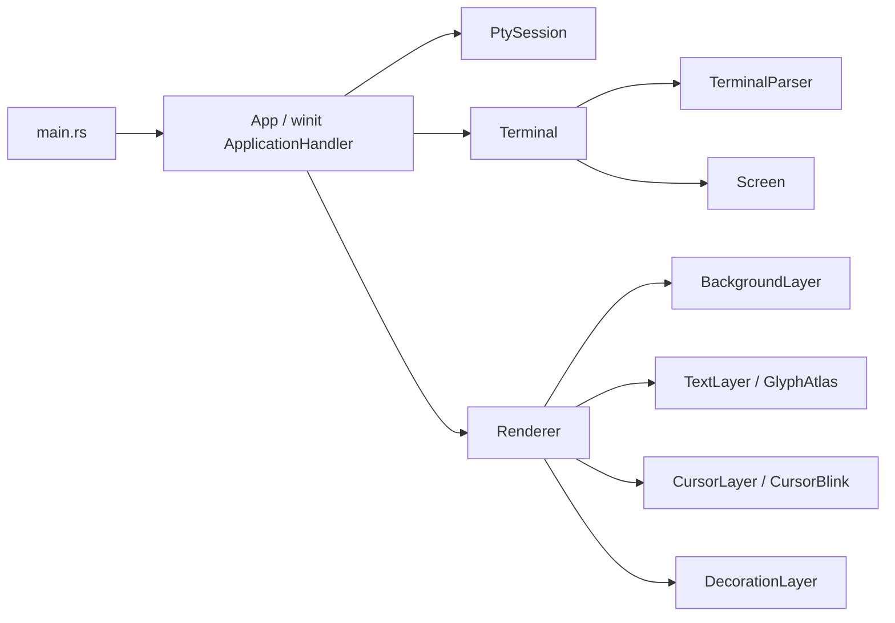

# Harbor 架构评审 · 现状核实

> 原始评审日期：2026-07-03
> 现状核实日期：2026-07-05

## 结论

整体架构基础健康的判断仍然成立。**P0 核心问题（文本渲染增量化）已全部修复**，验证后状态有重大变化。

| 状态       | 计数   |
| ---------- | ------ |
| ❌ 仍然存在 | 4      |
| ⚠️ 部分改善 | 2      |
| ✅ 已修复   | 7      |
| **总计**   | **13** |

**4 个未修复中 3 个在 P1** — scrollback 结构准备、`clear_cell_for_write` 边界防御、App 拆分仍是下一步重点。

---

## 本次核实检查过的文件

- `src/main.rs`
- `src/app.rs`
- `src/renderer.rs`
- `src/render.rs`
- `src/gpu.rs`
- `src/terminal/text.rs`
- `src/terminal/screen.rs`
- `src/config.rs`
- `src/metrics.rs`
- `src/font.rs`
- `src/decoration.rs`
- `src/background.rs`
- `src/pty.rs`
- `src/pty/windows.rs`
- `src/pty/unix.rs`
- `Cargo.toml`
- `docs/architecture-review.md`
- 当前 `cargo test`：152 passed（评审时 36 passed）。

验证结果：

- `rust-analyzer` diagnostics / cargo check 通过。
- `cargo test`：152 passed（+116 对比评审时）。

## 当前架构概览



对比原始评审，新增三个变化：

- `TextRenderer` / `TextDraw` → `TextLayer`（实现了 `Layer` trait）
- `CursorRenderer` → `CursorLayer`（实现了 `Layer` trait）
- 新增 `BackgroundLayer`（背景矩形）和 `DecorationLayer`（下划线/删除线）—— 均实现了 `Layer` trait
- `render.rs` 的旧 `Render` trait → 新的 `Layer` trait（`prepare` + `draw` 两阶段）

其他分层不变：

- `main.rs` 仍很薄。
- `App` 仍是事件协调器，直接持有 window/renderer/terminal/pty/blink。
- `Terminal` 保持 parser + screen 隔离。
- `pty.rs` 仍是平台门面。

---

# 优先级 0：文本渲染路径需要增量化

**✅ 已全部修复 — 4 个子问题均已解决。**

这是评审中最值得优先处理、也是最核心的问题。代码结构调整后，**全量重建模式已被增量模式取代**。核心改动在 `src/terminal/text.rs`。

## 现状证据（更新到当前代码）

`App::write_pty_output` 每收到 PTY 输出都会：

- `terminal.put_bytes(output)`；
- `renderer.prepare_layers(terminal.screen())`；
- `window.request_redraw()`。

位置：`src/app.rs:231-249`。

`Renderer::prepare_layers` 会调用所有已注册的 Layer：

- `self.background_layer.prepare(&self.gpu, Some(screen))`；
- `self.text_layer.prepare(&self.gpu, Some(screen))`；
- `self.cursor_layer.prepare(&self.gpu, Some(screen))`；
- `self.decoration_layer.prepare(&self.gpu, Some(screen))`。

位置：`src/renderer.rs:74-85`。

但 `TextLayer::prepare` 的实现已改为增量模式，位置：`src/terminal/text.rs:740-813`。

### 1. 预分配 text vertex buffer

**✅ 已修复。**

现在：

- `TextLayer` 持有预分配的 `vertex_buffer: wgpu::Buffer`，初始化时按 `rows * cols * 6` 顶点预分配（`text.rs:604-608`）。
- 内容变化时用 `queue.write_buffer` 更新，不再创建新 buffer（`text.rs:768-769`）。
- 尺寸变大时才扩容重建（`text.rs:761-765`）。
- 有 `dirty` 标志，无变化时跳过上传（`text.rs:790-793`）。

与 `CursorLayer` 一致：预分配 + `write_buffer` + dirty 标志。

### 2. `Screen` 提供 dirty rows

**✅ 已修复。**

现在：

- `Screen` 自带 `dirty_rows: Vec<bool>`，写入、erase、scroll、resize 时标记（`screen.rs:37`）。
- `TextLayer::prepare` 使用 `screen.dirty_rows()` 只重建并上传 dirty rows 对应的 vertex slice（`text.rs:801-810`）。
- 全量重建只在新增 glyph 需要更新 UV 时发生（`self.dirty` 触发，`text.rs:795-799`）。

### 3. glyph atlas 改为"缓存 + 增量上传"

**✅ 已修复。**

现在 `GlyphAtlas` 使用持久缓存 `glyphs: HashMap<char, AtlasGlyph>`：

- `update()` 只扫描 dirty rows 中的新字符（`text.rs:133-159`）。
- 只 rasterize 缓存中不存在的 glyph（`text.rs:150-158`）。
- 新增 glyph 通过 `GpuGlyphAtlas::update_glyphs()` 使用 `queue.write_texture` 单个 tile 增量上传（`text.rs:505-549`）。
- 不再因为屏幕滚动或内容替换重建整张 texture。
- 全量重建仅发生在 resize 或 atlas 满溢时（`full_update`，`text.rs:263-385`）。

### 4. atlas packing 改为多行 shelf packing

**✅ 已修复。**

现在：

- `GlyphAtlas.shelves: Vec<Shelf>` 管理多行排布（`text.rs:113`）。
- 新 glyph 尝试放入已有 shelf，否则新建一行（`text.rs:173-256`）。
- 高度降序排序以优化 packing（`text.rs:288-289`）。
- atlas 宽度固定为 `MAX_ATLAS_SIZE = 2048`，不再随字符数线性增长。

## 为什么这是最高优先级（现已完成）

终端最核心体验是输入 / 输出响应。修复前每个 PTY 输出 chunk 都可能触发全屏扫描、vertex buffer 重建、GPU buffer 创建。现在增量模式已落地：dirty row 扫描 + 预分配 vertex buffer + `write_buffer` + atlas 缓存 + shelf packing + `write_texture` tile 上传。

# 优先级 1：`App` 现在还可控，但应准备拆成控制器

**❌ 未修复。**

## 现状证据（更新到当前代码）

`App` 当前持有：

```rust
event_proxy: EventLoopProxy<AppEvent>,
window: Option<Arc<Window>>,
renderer: Option<Renderer>,
terminal: Option<Terminal>,
pty: Option<PtySession>,
cursor_blink: CursorBlink,
```

位置：`src/app.rs:25-38`。与评审时一致，没有变化。

`ApplicationHandler<AppEvent>` 里直接处理：

- `resumed`；
- `user_event`；
- `about_to_wait`；
- `window_event`；
- close；
- resize；
- redraw；
- keyboard input。

位置：`src/app.rs:54-158`。

`try_resume` 同时做：

- 创建 window；
- 创建一格 terminal bootstrap；
- `pollster::block_on(Renderer::new(...))`；
- 根据 renderer 算真实 terminal size；
- resize terminal；
- start PTY；
- request redraw。

位置：`src/app.rs:178-203`。

## 判断

现在 App 385 行（评审时 348 行）。仍在增长但未失控。评审列出的后续功能（scrollback、selection、tabs 等）堆上来时会继续膨胀。

好消息是 Renderer 内部已经用 Layer trait 封装了 4 个渲染层（background、text、cursor、decoration）——这是正确方向。但 App 本身未拆出任何控制器。

建议不变：

- 不要抽象 winit。保留 `ApplicationHandler`，把 App 降成事件路由层。
- 先拆 `PtyController`（收益最大，PTY 有线程/平台/错误处理边界）。
- 再拆 `TerminalController`（最好和渲染增量化一起做）。

---

# 优先级 1：`Terminal` 模型应为样式和 scrollback 做结构准备

## 当前做得好的地方（仍然成立）

`Terminal` facade 很清楚：

```rust
pub(crate) struct Terminal {
    parser: TerminalParser,
    screen: Screen,
}
```

位置：`src/terminal.rs:17-24`。保持不变。

`TerminalParser` 只处理字节流状态，`Screen` 只存可见 grid。这条边界是对的，不建议合并 parser 和 screen。

## 需要优化的地方 A：SGR 已实现（fg/bg/attrs 均存储并渲染）

**✅ 已修复。**

现在 `Cell` 包含完整的颜色和样式字段：

```rust
pub(crate) struct Cell {
    pub(crate) ch: char,
    wide_continuation: bool,
    pub(crate) fg: Color,      // 前景色
    pub(crate) bg: Color,      // 背景色
    pub(crate) attrs: CellAttrs, // 样式位集
}
```

位置：`src/terminal/screen.rs:132-143`。支持的颜色格式包括 `Default`、`Named(u8)`、`Bright(u8)`、`Indexed(u8)`、`Rgb(u8,u8,u8)`。

`Screen` 维护当前 SGR 状态：

- `current_fg: Color`
- `current_bg: Color`
- `current_attrs: CellAttrs`

位置：`src/terminal/screen.rs:187-191`。`write_char` 写入时自动附加当前 style。

Parser 正确分派 SGR：

```rust
b'm' => screen.set_sgr(&self.csi.params[..self.csi.len]),
```

位置：`src/terminal/parser.rs:382`。

渲染层使用这些数据：

- **TextLayer**：`glyph_color()` 处理 Bold→白色、Inverse→fg↔bg 交换、Default bg 回退白色（`src/terminal/text.rs:557-569`）。
- **BackgroundLayer**：inverse 时使用 `cell.fg` 作为矩形颜色（`src/background.rs:134-169`）。
- **DecorationLayer**：下划线/删除线使用 `cell.fg` 颜色（`src/decoration.rs` 全文件）。
- 测试覆盖：已有多项单元测试覆盖（`src/terminal/screen.rs` + `src/terminal/text.rs` 测试模块），包含 colors、attrs、reset、multi-param、compound clear 场景。

这意味着 `ls --color`、`git diff`、编译器彩色诊断已具备渲染所需的数据管线。

## 需要优化的地方 B：scrollback 现在无法支持

**❌ 未修复。**

`scroll_up` 直接丢弃顶行：

```rust
self.cells.copy_within(self.cols.., 0);
let first_blank = (self.rows - 1) * self.cols;
self.cells[first_blank..].fill(Cell::default());
self.cursor_y = self.rows - 1;
```

位置：`src/terminal/screen.rs:278-283`。与评审时完全相同。

建议不变：

- 如果近期做 scrollback，先做 row abstraction + ring buffer；
- 如果 scrollback 不在近期，先做 `CellStyle` 也可以；
- 但注意顺序：先加复杂样式再重构 scrollback，迁移成本更高。

---

# 优先级 1：修一个 terminal model 的潜在边界 bug

**❌ 未修复。**

`clear_cell_for_write`：

```rust
if self.cells[index].wide_continuation {
    self.cells[index - 1] = Cell::default();
    self.cells[index] = Cell::default();
    return;
}
```

位置：`src/terminal/screen.rs:182-195`。与评审时完全相同，未加 `checked_sub`。

当前代码路径下 `wide_continuation` 理论上不会出现在 column 0，所以这是 latent bug。但如果后续引入 row ring buffer、selection mutation、alternate screen、direct cell updates、style / erase 边界操作，`index - 1` 会在 debug panic，在 release 有 underflow 风险。

最小改法——加 `checked_sub` 防御：

```rust
if self.cells[index].wide_continuation {
    if let Some(prev) = index.checked_sub(1) {
        self.cells[prev] = Cell::default();
    }
    self.cells[index] = Cell::default();
    return;
}
```

---

# 优先级 2：配置常量应集中，但别急着做完整配置系统

**✅ 已修复。** 新增 `src/config.rs` 集中管理 `FONT_SIZE`、`TEXT_PADDING`、`BACKGROUND`、`BLINK_INTERVAL_MS`。

## 现状证据（更新到当前代码）

常量现在集中在 `src/config.rs`：

| 常量                | 原位置                                             | 新位置                                |
| ------------------- | -------------------------------------------------- | ------------------------------------- |
| `FONT_SIZE`         | `src/terminal/text.rs:15` + `font.rs:33,35` 硬编码 | `src/config.rs:15` → 两处均引用此值   |
| `TEXT_PADDING`      | `src/metrics.rs:3`                                 | `src/config.rs:20` → metrics.rs 引用  |
| `BACKGROUND`        | `src/gpu.rs:7`                                     | `src/config.rs:29` → renderer.rs 引用 |
| `BLINK_INTERVAL_MS` | `src/cursor.rs:300`                                | `src/config.rs:39` → cursor.rs 引用   |

`font.rs` 中的硬编码 `24.0` 已替换为 `crate::config::FONT_SIZE`（两处：`font.rs:33,35`）。

不做 struct / TOML / 热加载，符合评审建议。后续加新颜色（前景色、光标色、选区色）或行为参数直接扩展 `config.rs` 即可。
---

# 优先级 2：PTY 线程生命周期可以更明确

**❌ 未修复。**

```rust
pub(crate) struct PtySession {
    pty: Pty,
    _reader: JoinHandle<()>,
}
```

位置：`src/pty.rs:27-32`。与评审时完全一致。

reader thread 创建和 `pump_pty_output` 也没有变化。注释仍然是 "Joining is unnecessary on shutdown"。

建议不变：

- 给 `PtySession` 写显式 `Drop`：先关闭 `pty`，再 join reader thread。
- 如果担心阻塞，需要设计 cancellation channel 或把 reader handle 放进 `Option<JoinHandle<()>>`。
- 字段改名 `reader: Option<JoinHandle<()>>` 比 `_reader` 更清晰。

---

# 优先级 2：resize 顺序可以更稳

**⚠️ 部分改善。终端先于 PTY 的顺序仍没变，但加了 `new_size != current` 守卫和 error log。**

## 现状证据（更新到当前代码）

当前 resize 路径在 `src/app.rs:103-128`：

1. `renderer.resize(width, height)` — 更新 surface config、返回新 `TerminalSize`；
2. `new_size != current` 检查 — 尺寸没变则跳过；
3. `terminal.resize(new_size.rows, new_size.cols)`；
4. `renderer.prepare_layers(terminal.screen())`；
5. `pty.resize(new_size)` — 失败只 log；
6. `window.request_redraw()`。

相对评审时的改进：

- 加了 `new_size != current` 守卫，避免无变化时也全量走一遍；
- `pty.resize` 失败现在有 tracing error log。

但核心问题仍在：`terminal.resize` 先于 `pty.resize`。如果 `pty.resize` 失败，terminal 已经切到新尺寸但 shell 进程还在旧尺寸。

建议：

- 要么调整顺序：`pty.resize` 先于 `terminal.resize`；
- 要么接受当前策略（失败只 log，不回滚）并在注释里写清楚。

---

# 优先级 3：`render.rs` 的 trait

**⚠️ 原问题已变形。旧 `Render` trait 已被替换为 `Layer` trait，但低优先级清理项仍可保留。**

现在的 `src/render.rs`：

```rust
pub(crate) trait Layer {
    /// Uploads dirty GPU resources. No-op when nothing changed.
    fn prepare(&mut self, gpu: &GpuContext, screen: Option<&Screen>);
    /// Issues draw calls. Always lightweight, no GPU allocation.
    fn draw(&self, pass: &mut wgpu::RenderPass);
}
```

相对旧 `Render` trait（单方法 `fn render(&mut self, target: Target)`）的改进：

- 拆成了 `prepare`（GPU upload）和 `draw`（GPU draw call）两阶段。
- 明确标注了 `draw` 应 lightweight / no allocation。
- 四个 Layer 都实现了它。

但局限性仍在：

- 4 个实现，暂无需动态分发收益。
- `TextLayer::prepare` 不再分配新 buffer，已改用预分配 vertex buffer + `write_buffer` + dirty row 增量上传，与 trait 注释一致。
- 让读代码时多跳一个文件。

建议：这个问题优先级低。可以等 P0/P1 做完后再评估是否保留。

---

# 优先级 3：`crates/` 空目录

**✅ 已清理。** 根目录下 `crates/` 目录已不存在。

如果未来拆 workspace（`harbor-terminal-core`、`harbor-renderer`、`harbor-pty`），到那时再重建即可。不建议现在为了"架构感"拆 workspace。

---

# 暂不建议做的事

## 1. 不建议现在拆 workspace

当前最大文件（行数）：

- `src/terminal/text.rs`：~1190
- `src/decoration.rs`：~490
- `src/pty/windows.rs`：~370
- `src/font.rs`：~380
- `src/cursor.rs`：~350
- `src/app.rs`：~415

规模仍在单 crate 可维护范围内。先优化模块内部边界，比拆 crate 更划算。

## 2. 不建议现在引入复杂配置系统

集中常量（`src/config.rs`）已做完。不需要 TOML、热加载、CLI flags — 保持现状。

## 3. 不建议抽象 winit event loop

winit 的 `ApplicationHandler` 是正确平台模型。要瘦的是 `App` 的职责，不是替换 winit。

## 4. 不建议马上合并 cursor pipeline

`CursorLayer` 独立 pipeline 有一点重复，但边界清楚。把 cursor 合进 text atlas 需要额外颜色 / alpha / shape 设计，收益不大。当前真正的性能问题在 text path 的全量重建，不在 cursor path。


---

# 补充观察（不计入原 13 项）

以下问题在本次 Code Review 中发现，不属于原始评审的 13 项追踪范围，但值得记录。

## ⚠️ Shader 源码重复

`DECORATION_SHADER` 和 `BACKGROUND_SHADER` 是完全相同的 WGSL 代码（无纹理彩色四边形）。注释说 "duplicated per 'no shared GPU objects' convention"，但 shader 源码只是 `&str`——共享它不会导致 GPU 对象共享。~30 行重复，改一处漏一处是真实风险。

建议：在 `gpu.rs` 或新建 `shaders.rs` 放一个 `const UNTEXTURED_COLOR_SHADER: &str`，两层各自引用。低优先级清理项。

## ⚠️ `prepare` 方法模板代码

四个 `Layer` 实现的 `prepare` 结构几乎相同：

```
if resize → reallocate buffer, full rebuild, return
if !dirty && !any_dirty_rows → return
if dirty → full rebuild
else → incremental rebuild per dirty row
dirty = false
```

每层 ~60 行，差异只在 vertex builder 调用和 buffer 类型。目前 4 个实现可以接受，但再增加就会成为维护负担。

建议：暂不抽象。4 个副本还没到临界点。可以考虑一个 `prepare_with_builder(gpu, screen, &mut self.dirty, builder_fn)` 泛型 helper。

## ⚠️ TextLayer 在 `terminal/` 下，其他层在顶层

|
| `src/`
| ├── background.rs       ← 顶层
| ├── decoration.rs       ← 顶层
| ├── cursor.rs           ← 顶层
| └── terminal/
|     ├── text.rs         ← 跨两个域
|     ├── screen.rs
|     └── parser.rs

`TextLayer` 既管字形图集（渲染）又管终端语义（SGR 颜色），确实跨两个域。目前的归属有点随意。

建议：不改。这种不对称不会造成实际问题。`TextLayer` 是 terminal 模块的主要消费者和导出项，搬迁只是满足洁癖。

## ℹ️ `glyph_color` vs BackgroundLayer inverse 逻辑

`glyph_color` 有完整的 inverse 逻辑（含 Default bg → white 回退）。`BackgroundLayer::build_background_row_vertices` 内联了一份简化版——因为背景矩形在 `bg == Default` 时已跳过，不需要该回退。

建议：暂不动。当前两套逻辑各司其职。等第三处需要同样 inverse 判断时再统一。

---

# 建议实施顺序

按"最少风险、最大收益"推进。

## 第一批：P0 已完成 — 文本渲染增量化（已实施）

P0 的 4 个子问题（dirty rows、预分配 vertex buffer、atlas 缓存 + 增量上传、shelf packing）当前代码均已实现，不再需要排期。

## 第二批：配置常量集中化（已实施）

`src/config.rs` 已落地。`FONT_SIZE`、`TEXT_PADDING`、`BACKGROUND`、`BLINK_INTERVAL_MS` 四个常量已集中，`font.rs` 中的硬编码 `24.0` 已消除。

## 第三批：小而确定（1 天或更少）

1. 给 `clear_cell_for_write` 加 `checked_sub` 防御。
   低风险，守住底层不变量。行数改动：+3。

## 第四批：终端功能基础（预计 2–4 天）
2. ✅ ~~引入 `CellStyle` + SGR state。~~（已完成）
   先存样式，再接渲染颜色。注意：如果 scrollback 在近期，应先做 row abstraction。
   当前：`Cell` 已含 `fg`、`bg`、`attrs`，parser 已分派 SGR，渲染层已使用。

3. 决定 scrollback backing store。
   如果要近期做滚动回看，先做 row abstraction。

## 第五批：App 控制器拆分（预计 1–2 天）

4. 拆 `PtyController`。
   收益最大，PTY 有线程、平台、错误处理边界。

5. 拆 `TerminalController` / `RenderController`。
   在功能开始增长前让 `App` 回到薄路由层。

---

# 最终建议表

| 优先级 | 状态 | 建议                                                                      | 依据                                                                                                                   | 收益                                                |
| ------ | ---- | ------------------------------------------------------------------------- | ---------------------------------------------------------------------------------------------------------------------- | --------------------------------------------------- |
| **P0** | ✅    | Text 渲染增量化：dirty rows + 预分配 vertex buffer + `queue.write_buffer` | `src/terminal/text.rs:740-813` 已实现增量模式：dirty rows 扫描 + 预分配 buffer + `write_buffer` 更新                   | 已完成                                              |
| **P0** | ✅    | Glyph atlas 从"当前屏幕重建"改成"缓存 + 增量上传"                         | `src/terminal/text.rs:133-159` 只扫描 dirty rows；`text.rs:505-549` 用 `write_texture` 上传新 glyph tile               | 已完成                                              |
| **P1** | ❌    | `App` 拆 controller，但保留 winit `ApplicationHandler`                    | `src/app.rs:25-38` 直接持有 6 个字段                                                                                   | 防止后续功能全堆进 App                              |
| **P1** | ✅    | `CellStyle` / SGR state                                                   | `src/terminal/screen.rs:132-143` Cell 含 fg/bg/attrs；`parser.rs:382` 分派 SGR；`text.rs:557-569` `glyph_color()` 渲染 | 已完成                                              |
| **P1** | ❌    | Scrollback 前先抽象 row / backing store                                   | `src/terminal/screen.rs:335-341` scroll_up 丢弃顶行                                                                    | 避免后续大改 Screen / renderer                      |
| **P1** | ❌    | 修 `clear_cell_for_write` continuation 边界                               | `src/terminal/screen.rs:225-238` 有 `index - 1`                                                                        | 防御后续直接 cell mutation 带来的 panic / underflow |
| **P2** | ✅    | 集中配置常量，尤其 `FONT_SIZE`                                            | `src/config.rs` 已集中 `FONT_SIZE`、`TEXT_PADDING`、`BACKGROUND`、`BLINK_INTERVAL_MS`；`font.rs` 硬编码已消除          | 已完成                                              |
| **P2** | ❌    | 明确 PTY reader shutdown 语义                                             | `src/pty.rs:27-32` 存 `_reader: JoinHandle<()>` 但不 join                                                              | 可维护性、退出行为更清楚                            |
| **P2** | ⚠️    | Resize 顺序先 terminal 后 pty                                             | `src/app.rs:116-123` terminal 先于 pty；但已加 `new_size != current` 守卫和 error log                                  | 降低模型/PTY 尺寸不一致风险                         |
| **P3** | ⚠️    | `Layer` trait（原 `Render` trait 演化）                                   | `src/render.rs:6-11` 两方法 trait，仅 2 实现；`TextLayer::prepare` 已改增量模式                                        | 小幅降低模块跳转                                    |
| **P3** | ✅    | 清理空 `crates/`                                                          | 根目录已无 `crates/`                                                                                                   | 降低结构噪音                                        |

# 一句话总结

项目不是"架构错了"，而是"核心边界选对了"。
**P0 渲染增量化 + P1 SGR 实现 + P2 配置常量集中化已落地，13 个问题中 7 个修复、4 个未修复（3 个在 P1）、2 个部分改善。**
下一步：修 `clear_cell_for_write` 的 `checked_sub`，然后拆 `App` 控制器。
