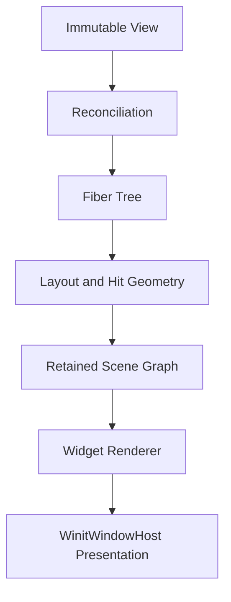

# Harbor Widget Runtime Architecture

> Status: Current implementation reference; open work is listed separately below.
>
> Scope: Harbor's internal declarative GPU UI runtime. This document describes the current architecture and invariants; it does not define a stable third-party API.

Architectural rationale is recorded in [`.grimoire/adr/`](../../.grimoire/adr/). In particular:

- [ADR-0007](../../.grimoire/adr/0007-retain-separate-paste-confirmation-window.md) keeps paste confirmation in a separate OS window.
- [ADR-0031](../../.grimoire/adr/0031-widget-winit-adapter-owns-native-host-infrastructure.md) consolidates native Window, Surface, Runtime, scheduling, and presentation lifecycle in the widget winit adapter host, while the binary coordinates application-wide multi-window and business policy.

## Goals

The runtime turns immutable Rust view descriptions into a retained GPU scene:

- component state invalidates subscribed fibers;
- reconciliation preserves identity and local state where type and key match;
- layout produces logical-pixel geometry;
- painting updates a retained scene graph;
- the renderer incrementally updates GPU resources;
- the winit integration schedules and presents frames through an owned native window host.

Harbor's terminal remains a focusable and layout-aware `CustomPaint` region. The terminal renderer, parser, model, and PTY stay outside the generic widget runtime.

## Non-Goals

The current runtime is not a general desktop GUI framework. It does not aim to provide:

- concurrent React-style rendering or interruptible work loops;
- arbitrary path clipping, general filters, or complex image/refraction effects (rounded decoration clipping already exists);
- complete rich text, complex shaping, bidirectional text, or accessibility bridges;
- general virtual lists, gesture recognition, or spatial indexes;
- a stable external DSL or macro API.

Those capabilities require a concrete Harbor use case and profiling evidence.

## Layer Model

| Layer                               | Lifetime     | Responsibility                                                    |
| ----------------------------------- | ------------ | ----------------------------------------------------------------- |
| `View` / widget description         | Short        | Immutable declaration produced during build                       |
| `Fiber`                             | Long         | Identity, hooks, signal subscriptions, children, and dirty flags  |
| Layout data                         | Long         | Constraints, logical geometry, clipping, and hit regions          |
| `SceneItem`                         | Long         | Retained GPU-visible primitive and paint order                    |
| Renderer resources                  | Long         | Pipelines, buffers, text resources, and incremental scene uploads |
| `WinitAdapter`                      | Per window   | Converts native events and tracks platform input/IME state        |
| Runtime scheduler / frame presenter | Per window   | Coalesces demand and applies surface/frame presentation policy    |
| `WinitWindowHost`                   | Per window   | Owns Window, Surface, Runtime, adapter and presentation lifecycle |
| `SharedGpu`                         | Multi-window | Shared wgpu Instance, Adapter, Device, and Queue                  |



A widget is a description, not a mutable long-lived control. Fiber state, geometry, scene state, and GPU resources have separate owners and lifecycles.

## Crate Boundary

`harbor-widget` contains platform-independent runtime logic plus an optional winit integration:

```text
crates/harbor-widget/src/
├── effects.rs            # platform-independent RuntimeEffects
├── fiber/                # arena, reconciliation, layout, paint
├── input/                # UiEvent, EventCtx, per-runtime input state
├── layout/               # constraints and geometry
├── renderer/             # retained-scene GPU encoding
├── runtime/              # update, event routing, and frame encoding
├── scene/                # Primitive, SceneItem, SceneDelta
├── scheduler.rs          # redraw and wait policy
├── signal.rs             # state and dependency invalidation
├── text.rs               # widget text-run preparation
├── view.rs               # Component, BuildCx, View, Key
├── widgets/              # containers, buttons, text, preview, CustomPaint
└── winit/                # feature-gated event and presentation integration
```

The core runtime may depend on wgpu but not on winit or Harbor's terminal model. The `winit` feature is the only platform-window boundary.

## Host and Frame Ownership

The feature-gated `harbor-widget::winit` adapter owns each native `Window`, its `Surface`, its independent `Runtime`, and its complete update/render/present lifecycle through `WinitWindowHost`. Shared GPU resources (`Instance`, `Adapter`, `Device`, `Queue`) are initialized and owned by `SharedGpu` and shared across windows.

The binary `Shell` coordinates `ActiveEventLoop` and `ApplicationHandler` dispatch, multi-window routing, terminal tabs, PTYs, paste safety, and fatal-error policy. For each redraw, `WinitWindowHost`:

1. resolves runtime updates/layout, external demand and presentation eligibility;
2. acquires a `SurfaceTexture` when the frame is eligible and the surface is usable;
3. creates the command encoder and encodes the retained widget scene;
4. invokes `CustomPaint` handlers in paint order (injecting frame-scoped GPU access);
5. submits the command buffer;
6. performs the window pre-present notification and presents;
7. returns a classified outcome (`HostFrameOutcome`) to the application.

Surface policy belongs to the winit integration: lost and outdated surfaces are reconfigured, timeouts and occlusion skip a frame, zero-sized windows suspend drawing, and fatal out-of-memory outcomes return to the application.

## Per-Window Runtime Model

Each OS window owns an independent:

- `Runtime` and fiber tree;
- native input adapter, runtime scheduler and frame presenter;
- focus, hover, pointer capture, modifier, touch, and IME state;
- surface state and viewport.

Device, queue, font, and text resources may be shared where their ownership permits it. Surface and input state never cross window boundaries.

Paste confirmation remains a separate winit window by ADR-0007. The application owns the cross-window gate that prevents new terminal keyboard input and paste requests while confirmation is active. The confirmation window uses the same runtime integration boundary as the main window, but has its own Runtime and Surface.

## Fiber Identity and Reconciliation

`FiberId` contains a slot index and generation. Reusing a slot increments its generation, so stale event targets, signal subscriptions, callbacks, and pointer captures cannot address a newly mounted node.

Current matching rules are:

1. a key unique in both old and new sibling lists reuses a compatible widget-type fiber across positions;
2. unkeyed siblings reuse only a compatible unkeyed fiber at the same position;
3. a type/key mismatch creates a new fiber; duplicate sibling keys emit diagnostics and do not reuse ambiguous fibers;
4. unmatched old fibers unmount after new children are selected, removing subscriptions and transient input references.

Keyed sibling reordering is implemented. Evidence: [`reconcile_children_with_externals`](../../crates/harbor-widget/src/fiber/reconcile.rs) and [`child_construction` tests](../../crates/harbor-widget/tests/child_construction.rs), including keyed reorder state preservation. This does not imply dirty-subtree rebuilding or cross-parent state migration.

## State and Invalidation

`Signal<T>` is a UI-thread state source. During build, a fiber subscribes to the signals it reads. A write marks subscribed fibers dirty and coalesces work for the owning runtime.

Dirty flags separate intended work:

| Flag             | Meaning                         | Required work                   |
| ---------------- | ------------------------------- | ------------------------------- |
| `BUILD_DIRTY`    | View or local state changed     | Reconciliation                  |
| `LAYOUT_DIRTY`   | Constraints or geometry changed | Layout, paint, and hit geometry |
| `PAINT_DIRTY`    | Visual output changed           | Scene update                    |
| `HIT_TEST_DIRTY` | Interactive geometry changed    | Hit data update                 |

Cross-thread producers do not mutate signals directly. They notify the UI thread through host-owned channels and external runtime invalidation.

The current runtime tracks fiber-level invalidation but may still rebuild from the root for dirty build work. True dirty-subtree rebuilding remains follow-up work; the existing dirty flags must not be documented as stronger isolation than the implementation provides.

## Layout

Layout uses logical pixels. Physical scaling occurs at the rendering boundary so layout, hit testing, and input coordinates share one coordinate system.

Layout uses indexed parent-directed child measurement, bounded corrective passes and an atomic final-geometry commit. See [Flex Layout](../flex-layout.md) for the complete contract; the former child-first layout description no longer applies.

Current building blocks include `SizedBox`, `ConstrainedBox`, `Padding`, `Align`, `Row`/`Column` over a shared Flex engine, `Expanded`, `Flexible`, `Spacer`, `Stack`, `Separator`, `ScrollArea` and `LayoutObserver`. Focus wrappers, labels, buttons, `PreviewPane` and `CustomPaint` compose on that foundation.

The layout observer publishes committed geometry for application coordination; the application still owns PTY resize policy. Generic positioned children, wrapping/grid layout and virtual collections remain separate work. Resize, scale, flex constraints and retained GPU resources have focused CPU/headless tests, not an implied Windows visual acceptance result.

## Input and Focus

Pointer routing follows a path model:

```text
hit test
  -> root-to-target capture
  -> target
  -> target-to-root bubble
```

Handlers write commands to `EventCtx` rather than mutating runtime ownership structures during the walk. Commands include focus requests, pointer capture/release, paint invalidation, propagation stop, and focus navigation.

The runtime supports:

- reverse-paint-order hit testing;
- per-pointer capture;
- release and cancellation cleanup;
- hover and focus transitions;
- Tab and Shift+Tab traversal through `FocusScope`;
- Enter and Space activation for focusable controls;
- modal routing inside a runtime;
- keyboard and IME delivery to the focused target.

The winit adapter owns conversion details such as scale-aware positions, modifier state, touch IDs, mouse-button quarantine after focus loss, and IME commit deduplication.

Reusable `MouseRegion`/`InteractiveRegion`, focus handles, `Shortcuts`/`Actions`, themed `Button`/`IconButton`, and `ThemeProvider` expose current desktop interaction mechanisms. Theme inheritance is not a complete locale/direction/environment system; disabled/focus behavior is not a Windows accessibility bridge.

The native adapter routes IME commit and preedit; the terminal bridge provides a transient preedit overlay and candidate position. A general-purpose editable `TextField` remains unimplemented.

## Retained Scene and Rendering

Painting produces `SceneItem` values with stable IDs, paint order, clipping, and a `Primitive`. The `SceneGraph` computes a `SceneDelta` of additions, modifications, and removals. The renderer applies that delta to retained GPU data instead of rebuilding the entire scene every frame.

Core primitives are:

- colored quads and rounded rectangles;
- borders and outer shadows;
- prepared text runs;
- external draws.

Batching may combine only adjacent items with compatible pipeline, bindings, and clipping. Transparent items must not be reordered across paint boundaries.

Rectangular clips map to GPU scissors. Rounded decoration clips also affect painting and hit testing, including a rounded mask path for external terminal draws. General arbitrary-path clipping, sampled backdrop filters and liquid refraction are not implemented.

## CustomPaint and Terminal Integration

`CustomPaint` creates an external scene primitive associated with an `ExternalDrawId`. During frame encoding, the runtime flushes compatible widget batches, applies the external item's physical allocation and scissor, invokes its registered handler, and restores state for following widget primitives.

The terminal is responsible for:

- PTY I/O and terminal input semantics;
- VT parsing and screen state;
- terminal-specific text, background, decoration, selection, cursor, and scrollbar rendering.

The runtime is responsible for the terminal region's layout, clipping, focus, event routing, paint order, and frame scheduling.

## Text Boundary

`harbor-text` provides shared font selection, fallback resolution, glyph identity, rasterization, and metrics. Terminal and widget renderers consume that shared CPU-side text foundation but keep rendering adapters appropriate to their layouts.

Terminal text is monospace and cell-oriented. Widget text may use run-oriented layout. Complex shaping, bidirectional text, and rich-text editing remain outside the current scope.

## Scheduler

`RuntimeEffects` expresses platform actions without performing them in core runtime code. Effects include redraw, control-flow deadlines, cursor, IME, and clipboard requests.

The per-window scheduler coalesces external invalidations and selects `Wait`, `WaitUntil`, or `Poll` from runtime activity, animation deadlines, surface state, and host deadlines. A quiet runtime must not continuously request redraw.

## Invariants

| Invariant              | Constraint                                                                                                                             |
| ---------------------- | -------------------------------------------------------------------------------------------------------------------------------------- |
| Resource ownership     | `WinitWindowHost` owns per-window native/runtime resources; `SharedGpu` owns shared GPU resources; the app coordinates business policy |
| Runtime isolation      | Each OS window has independent runtime, scheduler, surface, and input state                                                            |
| Stale-reference safety | Generation IDs prevent callbacks and captures from targeting reused slots                                                              |
| Event safety           | Event handlers emit commands; ownership mutations occur after routing                                                                  |
| Paint correctness      | Alpha-sensitive paint order is preserved; only adjacent compatible items batch                                                         |
| Idle behavior          | No dirty work, deadline, or animation means no redraw request                                                                          |
| Text consistency       | Terminal and widget rendering share `harbor-text` contracts                                                                            |
| Extension discipline   | Concurrency, spatial indexing, complex clipping, and animation require measured need                                                   |

## Open Architecture Work

The following are intentional follow-ups rather than current guarantees:

- true dirty-subtree rebuilds;
- richer clipping and image/path primitives;
- accessibility integration;
- complex text shaping;
- profiling-gated work prioritization or interruptible rendering.

Use the [Widget Capability Plan](../widget-capability-plan.md) for the remaining toolkit catalog and the [Next-Stage Product Plan](../next-stage-plan.md) for pane, command-palette and visual product work. Existing toolkit mechanisms should be reused, not re-planned as missing foundations.
