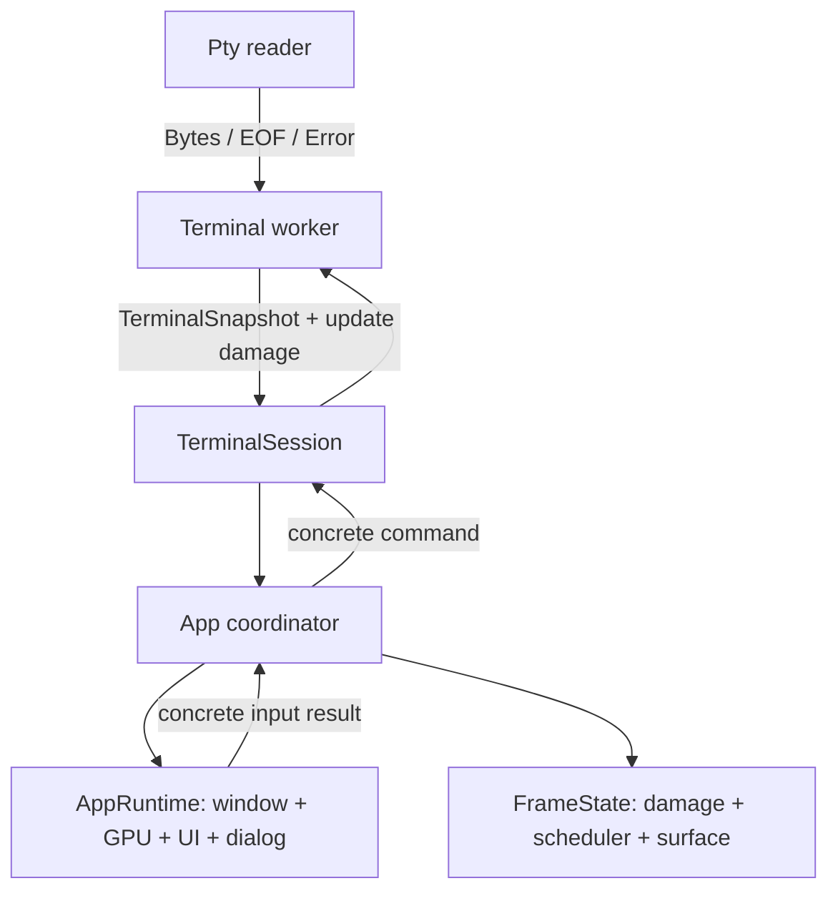

# Terminal Rendering Simplification - Plan

## Goal Capsule

- **Objective:** Remove diagnostic scaffolding and single-implementation interface layers from the terminal rendering path while preserving terminal/renderer crate boundaries and all existing input, worker, and rendering behavior.
- **Authority:** The user request and PR #57 review comments define scope. `docs/adr/0003-crate-workspace-split.md` remains authoritative for dependency direction unless this plan explicitly amends its terminology.
- **Execution profile:** Characterize behavior at each boundary before removing it; preserve concrete data flow rather than replacing traits with new generic or dynamic indirection.
- **Stop conditions:** Do not make `harbor-render` depend on `Screen`, `TerminalWorkerClient`, or winit event-loop types. Do not create a new crate unless the binary-local state split exposes a stable independent boundary.
- **Tail ownership:** The implementing change replies to and resolves the applicable PR #57 threads only after the corresponding behavior and tests are verified.

---

## Product Contract

### Summary

The current terminal-rendering branch introduces diagnostic collectors, compatibility shims, duplicated snapshot types, and internal capability traits that do not represent real replaceable implementations. The resulting types and `App` state obscure the concrete terminal-worker to renderer flow.

### Problem Frame

`TerminalFacade` has one implementation, while `caps.rs` multiplies that interface into capability traits and forwarding contexts. `mem_tracker` and the render profile collector add global or shared diagnostic state without an approved product requirement. Windows backend selection is runtime-configured and defaults to DX12/Vulkan instead of the requested GL default. `App` owns 18 fields spanning unrelated lifecycles.

### Requirements

**Simplification**

- R1. Remove the single-implementation terminal capability matrix and express renderer interaction through concrete snapshot data plus concrete interaction results.
- R2. Use one terminal-to-UI/render data projection and remove duplicate wrapper and view-interface layers.
- R3. Remove diagnostic-only memory tracing and the unapproved render profile collector without removing functional upload selection or text layout data.
- R4. Delete compatibility and wrapper code that has no remaining production caller.

**Platform configuration**

- R5. Make Windows select OpenGL/GLES by default and select DX12 or Vulkan only through mutually exclusive Cargo feature flags.
- R6. Remove runtime backend environment-variable selection so build configuration is the sole selector.

**Structure and behavior**

- R7. Group `App` state by runtime, terminal session, and frame lifecycle while keeping `App` as the winit `ApplicationHandler` coordinator.
- R8. Preserve clean PTY EOF versus read-error behavior, worker status reporting, terminal snapshot publication, input handling, scrolling, copy/paste confirmation, surface recovery, and rendering behavior.
- R9. Preserve the no-cycle crate direction: render consumes pure terminal data but does not reference terminal model or app runtime internals.

### Acceptance Examples

- AE1. On Windows with no backend selector feature, startup selects `wgpu::Backends::GL`; the environment variables `HARBOR_WGPU_BACKEND` and `WGPU_BACKEND` have no effect.
- AE2. A build selecting both DX12 and Vulkan fails at compile time with an actionable mutual-exclusion error.
- AE3. A PTY returning EOF publishes any final dirty snapshot, transitions the worker to `Stopped`, and does not report a worker failure.
- AE4. A PTY read error transitions the worker to `Failed` with the read error message.
- AE5. Selection drag, selection copy, paste confirmation, mouse-wheel scrolling, and cursor/scrollbar deadlines issue the same worker commands and redraw requests as before the simplification.

### Scope Boundaries

**In scope**

- The current PR #57 code and comments in terminal worker, renderer, terminal snapshot, GPU backend selection, metrics, and app lifecycle paths.
- Updating ADR terminology if `TerminalSnapshot` replaces the accepted `RenderSnapshot` name while preserving the same pure-data boundary.

**Deferred for later**

- A separately scoped memory/profiling product with an approved collection, storage, privacy, and overhead policy.
- Reducing linked WGPU backend implementations beyond selection semantics. That requires target-specific Cargo dependency packaging and is not implied by the selector features.
- New workspace crates for app state groups.

---

## Planning Contract

### Key Technical Decisions

- KTD1. Replace `TerminalFacade`, `TerminalView`, access traits, and capability contexts with concrete data and concrete interaction results. Static generic dispatch would retain the same conceptual interface, so it is not the target design.
- KTD2. Make `TerminalSnapshot` the sole terminal-to-UI/render projection because it is already the richer value; remove `RenderSnapshot` and `Screen::terminal_snapshot()` only as one atomic migration. Amend ADR-0003 to state that `TerminalSnapshot` is the pure projection and that render still never references `Screen`.
- KTD3. Keep EOF as a semantic state, but fold `PtyReaderStatus` into concrete `PtyMessage` variants for bytes, EOF, and read error. EOF is normal process termination, not a render-validity guard.
- KTD4. Remove `mem_tracker` and `RenderMetrics` profiling. Keep `UploadPlan`, `UploadMode`, and `UploadPolicy` because they select functional update behavior; move `TextMetrics` beside text layout rather than leave unrelated responsibilities in `metrics.rs`.
- KTD5. Make backend selection compile-time at the application feature boundary. A Windows build with no explicit selector returns GL; `backend-dx12` and `backend-vulkan` override it. Use `compile_error!` for conflicting selectors. Keep non-Windows behavior unchanged.
- KTD6. Use concrete private structs inside the binary crate for `App` lifecycle state before considering a crate split.

### High-Level Technical Design

`TerminalSnapshot` remains a `harbor-types` value. `App` alone maps concrete UI outcomes to worker commands and redraw scheduling; `harbor-render` does not receive a worker facade or winit event-loop proxy.

### Sequencing

U1 and U2 remove independent scaffolding first. U3 establishes the single data boundary needed by U4. U5 groups the app around the simplified data flow. U6 updates architecture documentation and validates the combined cutover.

### Risks and Mitigations

- Snapshot unification touches rendering and selection broadly. Add characterization coverage for snapshot fields and selection/scroll inputs before deleting the old types.
- Worker EOF ordering can lose final terminal output. Verify dirty snapshot flush before `Stopped` against a controlled reader EOF.
- Cargo feature defaults are package-wide, not target-specific. Test Windows selector behavior in Windows CI; do not claim that selector features alone reduce linked backend code.
- State regrouping can introduce borrow conflicts that tempt new facades. Keep aggregation structs private and move methods with their owned state instead of introducing services.

### Sources and Research

- `docs/adr/0003-crate-workspace-split.md` defines the render/terminal and PTY/app dependency boundaries.
- `crates/harbor-render/src/caps.rs`, `src/terminal_worker.rs`, and `src/app/ui.rs` show the one-implementation facade and context matrix.
- `crates/harbor-render/src/gpu.rs` currently parses runtime backend variables and defaults Windows to DX12/Vulkan.
- `src/mem_tracker.rs` and `crates/harbor-render/src/metrics.rs` contain the diagnostic collectors targeted for removal.
- PR #57 review comments provide the requested simplification and behavior questions.
- WGPU 30 feature names distinguish Cargo `gles` from runtime `wgpu::Backends::GL`: https://raw.githubusercontent.com/gfx-rs/wgpu/v30.0.0/wgpu/Cargo.toml

---

## Implementation Units

### U1. Remove diagnostic collectors and compatibility shim

- **Goal:** Remove unapproved memory and render-profile telemetry plus the unused terminal re-export.
- **Requirements:** R3, R4.
- **Dependencies:** None.
- **Files:** `src/mem_tracker.rs` (delete), `src/main.rs`, `src/app.rs`, `src/terminal_worker.rs`, `src/terminal.rs` (delete), `src/app/input.rs`, `Cargo.toml`, `crates/harbor-render/src/metrics.rs`, `crates/harbor-render/src/gpu.rs`, `crates/harbor-render/src/lib.rs`.
- **Approach:** Delete `mem_tracker`, its feature, environment checkpoint, global allocator, counters, OS memory query, and callers. Delete `RenderMetrics`, snapshots, sample buffers, profile reporting, and their `Arc` plumbing through GPU, worker, and app. Retain the functional upload policy types in an upload/GPU-owned module and relocate `TextMetrics` to the text-layout owner. Remove `src/terminal.rs` and import `harbor_terminal` directly.
- **Patterns to follow:** Keep current `FrameScheduler` and GPU upload behavior; do not substitute one telemetry singleton for another.
- **Test scenarios:** Confirm upload policy returns `None`, incremental, and full choices for empty, sparse, fragmented, broad, and forced damage. Confirm text layout metrics continue to produce existing terminal size and glyph geometry. Confirm no environment variable enables memory/profile output.
- **Verification:** No references to `mem_tracker`, `mem-trace`, `HARBOR_TRACE_MEM`, `RenderMetrics`, or `src::terminal` remain; render upload and text-layout tests pass.

### U2. Make WGPU backend selection compile-time

- **Goal:** Select GL by default on Windows and DX12/Vulkan only via explicit, conflicting-safe Cargo features.
- **Requirements:** R5, R6, AE1, AE2.
- **Dependencies:** U1.
- **Files:** `Cargo.toml`, `crates/harbor-render/Cargo.toml`, `crates/harbor-render/src/gpu.rs`, relevant CI workflow if one exists.
- **Approach:** Introduce root and render feature forwarding for the selected backend. Centralize backend construction in a small cfg-selected helper. On Windows, select GL without an override; explicit DX12 or Vulkan features select their matching runtime `Backends` value. Add pairwise `cfg(all(feature = ..., feature = ...))` `compile_error!` guards for every conflicting selector combination. Remove all runtime environment variable reads. Preserve the non-Windows `Backends::all()` behavior.
- **Patterns to follow:** Use WGPU Cargo feature `gles` only when upstream feature forwarding is required; use `Backends::GL` in Rust source. Avoid runtime fallback chains that make the build selector ambiguous.
- **Test scenarios:** Windows default yields GL; each explicit selector yields its intended backend; every pair of selectors fails to compile; unset or conflicting backend environment variables do not change the selected backend.
- **Verification:** Windows CI builds the default, DX12, and Vulkan configurations. The conflict matrix is rejected at compile time. A startup smoke log records the selected adapter backend.

### U3. Unify the terminal snapshot projection and reader termination messages

- **Goal:** Collapse duplicate snapshot/view wrappers while retaining the pure cross-crate data boundary and explicit EOF/error semantics.
- **Requirements:** R2, R8, R9, AE3, AE4.
- **Dependencies:** U1.
- **Files:** `crates/harbor-types/src/lib.rs`, `crates/harbor-terminal/src/lib.rs`, `crates/harbor-terminal/src/screen.rs`, `crates/harbor-terminal/src/selection_model.rs`, `crates/harbor-render/src/background.rs`, `crates/harbor-render/src/cursor.rs`, `crates/harbor-render/src/decoration.rs`, `crates/harbor-render/src/scrollbar.rs`, `crates/harbor-render/src/selection.rs`, `crates/harbor-render/src/text.rs`, `src/terminal_worker.rs`, `crates/harbor-pty/src/lib.rs`.
- **Approach:** Make `TerminalSnapshot` the single snapshot published by `Screen` and consumed by UI/render. Remove `RenderSnapshot`, `TerminalView`, `SnapshotView`, and the duplicate conversion wrapper. Replace `PtyReaderStatus` with direct `PtyMessage` terminal variants and keep the worker's final dirty-snapshot flush before setting `Stopped`.
- **Patterns to follow:** Preserve `docs/adr/0003-crate-workspace-split.md` dependency direction; use immutable value data across the boundary rather than references to `Screen`.
- **Test scenarios:** Covers AE3. PTY bytes followed by EOF produce a final snapshot then `Stopped`. Covers AE4. PTY read error produces `Failed` with the error. Selection model reads all required scrollback, cursor, and input-mode fields from `TerminalSnapshot`. Snapshot fields and dirty ranges survive publication unchanged.
- **Verification:** Terminal, worker, and renderer tests compile without `RenderSnapshot`, `TerminalView`, or `PtyReaderStatus`; no render crate imports terminal model internals.

### U4. Remove renderer capability traits and map concrete interaction results in app

- **Goal:** Remove the single-implementation capability matrix without changing UI interaction behavior.
- **Requirements:** R1, R8, R9, AE5.
- **Dependencies:** U3.
- **Files:** `crates/harbor-render/src/caps.rs` (delete or reduce to concrete input/result definitions), `crates/harbor-render/src/lib.rs`, `crates/harbor-render/src/selection.rs`, `crates/harbor-render/src/scrollbar.rs`, `crates/harbor-render/src/cursor.rs`, `src/app/ui.rs`, `src/app.rs`, `src/terminal_worker.rs`.
- **Approach:** Replace `TerminalFacade`, access traits, and selection/scrollbar/cursor context structs with concrete snapshot inputs and typed interaction results. Keep renderer-owned state transitions in renderer components; return requests for worker commands, redraws, and auto-scroll changes to `UiRoot`. Let app execute those requests directly against `TerminalWorkerClient` and `FrameScheduler`.
- **Patterns to follow:** Prefer a small closed result enum or struct over callbacks, trait objects, generic capability bounds, or a new command service.
- **Test scenarios:** Covers AE5. Selection copy only emits a copy request for a non-empty range. Paste returns direct-send versus confirmation using snapshot input modes. Mouse wheel and scrollback navigation produce the same request IDs. Drag start/end toggles scroll-snap suppression and requests redraw. Cursor and scrollbar deadlines still produce the earliest deadline.
- **Verification:** `TerminalFacade`, `TerminalAccess`, `RedrawAccess`, `GpuAccess`, `ModifiersAccess`, `ScrollAccess`, and capability context structs have no remaining definitions or callers. UI integration tests exercise worker command mapping and redraw scheduling.

### U5. Group app state by lifecycle

- **Goal:** Reduce `App` to a winit coordinator with private, concrete lifecycle aggregates.
- **Requirements:** R7, R8.
- **Dependencies:** U2, U4.
- **Files:** `src/app.rs`, `src/app/ui.rs`, `src/event.rs`, `src/app/paste_dialog.rs`, `src/terminal_worker.rs`.
- **Approach:** Introduce private `AppRuntime` for window/GPU/UI/dialog ownership, `TerminalSession` for worker/update/snapshot/request state, and `FrameState` for damage, scheduler, surface recovery, and present state. Move methods with their data ownership. Keep `App` as the only `ApplicationHandler` and avoid a crate split.
- **Patterns to follow:** Retain `FrameScheduler` as the scheduler state owner. Keep `TerminalWorkerClient` shutdown and mailbox access in terminal-session methods. Use direct borrows between state groups; do not add forwarding methods on `App`, command-processing services, or a replacement trait facade.
- **Test scenarios:** Worker update coalescing preserves full versus incremental damage behavior. Resize queues one terminal resize and redraw. Surface lost/suboptimal behavior retains bounded recovery. Paste-dialog confirmation sends the original text once. Worker failure remains visible through app state.
- **Verification:** `App` fields are orchestration-only references to the three aggregates plus any unavoidable input scalar. Existing scheduler and app behavior tests pass without introducing a new crate or trait facade.

### U6. Align ADR and PR review resolution

- **Goal:** Record the retained dependency boundary and close verified review feedback with accurate rationale.
- **Requirements:** R9.
- **Dependencies:** U2, U3, U4, U5.
- **Files:** `docs/adr/0003-crate-workspace-split.md`, `docs/roadmap.md` and `docs/checklist.md` only if their matching entries change, PR #57 review threads.
- **Approach:** Amend ADR-0003 as a simplification of redundant snapshot/view definitions: `TerminalSnapshot` replaces the `RenderSnapshot` name while retaining the same pure-data projection and no `Screen` dependency. Reply to deletion requests with the completed removal, EOF question with its clean-exit distinction, and retained two-loop rationale with the history/live ring mapping explanation. Resolve only threads whose requested outcome is verified.
- **Test expectation:** none -- documentation and review-thread synchronization follow verified implementation work.
- **Verification:** ADR continues to state no render-to-terminal-model dependency and no PTY-to-winit dependency. PR threads have accurate replies and only completed items are resolved.

---

## Verification Contract

| Scope | Required proof |
|---|---|
| U1 | Targeted upload-policy/text-layout tests plus workspace compilation with no deleted diagnostic symbols. |
| U2 | Windows build matrix: default, DX12 selector, Vulkan selector, and each conflicting selector pair. Startup smoke check records the selected adapter backend. |
| U3 | Terminal and worker tests covering final snapshot-before-EOF-stop and reader-error failure state. |
| U4 | Renderer/UI interaction tests for selection, copy, paste confirmation, scrolling, drag suppression, and timer deadlines. |
| U5 | App/frame tests for worker updates, resize, surface recovery, dialog confirmation, and worker failure propagation. |
| Final | `cargo fmt --all -- --check`, `cargo test --workspace`, `cargo check --workspace`, then a Windows runtime smoke test of default GL and each supported explicit selector. |

---

## Definition of Done

- Every R-ID and AE-ID is covered by an implemented unit and its verification outcome.
- No deleted diagnostic, compatibility, facade, view, or snapshot wrapper symbol remains.
- The renderer depends only on pure terminal value data, not `Screen`, worker-client, or winit event-loop internals.
- Windows has deterministic default GL selection and compile-time-conflict-safe explicit backend selection.
- EOF and reader error remain distinguishable in worker status and preserve final output publication.
- `App` is a coordinator over concrete private lifecycle state, without a new crate or replacement abstraction layer.
- ADR and directly related roadmap/checklist entries match the final code; verified PR #57 threads are replied to and resolved.
- Experimental or abandoned refactor scaffolding is removed before completion.
