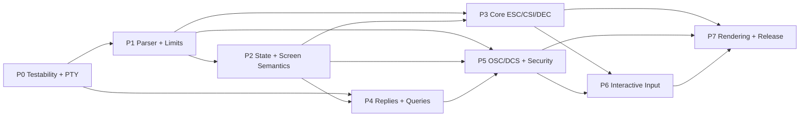

# WGPU Terminal Emulator Roadmap

> This roadmap has two coordinated tracks: the protocol track closes terminal correctness gaps, while the product track turns the core into a daily-usable application.
> The protocol audit in [`checklist.md`](checklist.md) is the source of truth for feature coverage. A roadmap checkbox is not evidence of implementation; update it only after tests or runtime acceptance pass.

## Contents

- [1. Scope and Goals](#1-scope-and-goals)
- [2. Current Baseline](#2-current-baseline)
- [3. Roadmap at a Glance](#3-roadmap-at-a-glance)
- [4. Execution Model](#4-execution-model)
- [5. Protocol Track: Detailed Plan](#5-protocol-track-detailed-plan)
- [6. Product Track: Detailed Milestones](#6-product-track-detailed-milestones)
- [7. Release Gates and Definition of Done](#7-release-gates-and-definition-of-done)
- [8. Final Working Agreement](#8-final-working-agreement)

## 1. Scope and Goals

Build a high-performance terminal emulator with Rust, winit, wgpu, and a custom text renderer.

Product boundary:

- fast terminal core
- GPU-accelerated rendering
- strong terminal correctness
- minimal built-in UI features
- an extensible architecture for future developer-tool or agent integration

The first compatibility target is the shell/Vim/tmux baseline. Optional protocols such as Sixel and Kitty graphics are explicitly deferred until safe string consumption and memory limits are complete.

## 2. Current Baseline

Snapshot date: **2026-07-15**.

| Area           | Current state                                                                                                                                                                                                                                                  | Immediate implication                                                         |
| -------------- | -------------------------------------------------------------------------------------------------------------------------------------------------------------------------------------------------------------------------------------------------------------- | ----------------------------------------------------------------------------- |
| Protocol audit | 1,054 checklist items; 600 clearly implemented; 454 incomplete or unverified                                                                                                                                                                                   | Use `checklist.md` to select the next slice                                  |
| Tests          | `cargo test --workspace`: 359 passed, 0 failed, 2 ignored (2026-07-15)                                                                                                                                                                                         | Add focused tests before changing protocol state                              |
| Parser         | ECMA-48/DEC state machine: 17 states covering CSI, OSC, DCS, and SOS/PM/APC string families; 8-bit C1 recognition (test-only); chunk-equivalence test harness                                                                                                  | Production C1 config, fuzz, and discard-after-limit tests remain              |
| Terminal model | Cell grid, SGR, cursor, scroll regions, editing, scrollback, alternate screen, DECSCUSR, pending_wrap, terminal modes (DECCKM, DECAWM, DECOM, IRM, LNM, DECLRMM), tab stops, left/right margins, basic RIS/DECSTR                                              | Extend state before adding more dispatch cases                                |
| PTY            | Windows ConPTY works; Unix startup is a `bail!()` stub                                                                                                                                                                                                         | Unix PTY is a prerequisite for cross-platform runtime acceptance              |
| CI             | No `.github/workflows` workflow is present                                                                                                                                                                                                                      | Local tests are not cross-platform CI evidence                                |
| Replies        | No parser-to-PTY reply channel                                                                                                                                                                                                                                 | DSR, DA, DECRQM, DECRQSS, and XTGETTCAP cannot work yet                       |
| Strings        | OSC framing consumed with bounded collection (MAX_OSC_BYTES) and discard-warn; DCS/APC/PM/SOS handled by dedicated parser states with consume-only dispatch                                                                                                    | Add OSC side effects for supported families; discard-after-limit tests remain |
| Input          | Basic text, control bytes, VT arrows, Home/End/Page/F1-F12/Insert/Delete, normal-screen bare PageUp/PageDown/Home/End scrollback navigation, cursor application keys (DECCKM), application keypad (DECKPAM), modifier encoding, bracketed paste, scroll keymap | Focus, mouse, and IME are not wired                                           |

## 3. Roadmap at a Glance

### 3.1 Protocol Track

| Phase | Deliverable                              | Status  | Main outcome                                            | Depends on   |
| ----- | ---------------------------------------- | ------- | ------------------------------------------------------- | ------------ |
| P0    | Testability and platform foundation      | Planned | Parser harness, Unix PTY, CI baseline                   | Start here   |
| P1    | Streaming parser and safety contract     | Planned | Full states, C1, bounded strings, recovery              | P0           |
| P2    | Terminal state and screen semantics      | Planned | Modes, wrap, margins, tabs, resets, protection          | P1           |
| P3    | Core ESC/CSI/DEC compatibility           | Planned | Shell, Vim/Neovim, less, tmux sequence slice            | P1 + P2      |
| P4    | Replies and device queries               | Planned | DSR, DA, DECRQM, DECRQSS, XTGETTCAP                     | P0 + P1 + P2 |
| P5    | OSC/DCS and secure strings               | Planned | Titles, cwd, hyperlinks, clipboard, bounded consumption | P1 + P2 + P4 |
| P6    | Interactive input protocols              | Planned | Application keys, paste, focus, mouse, IME              | P2 + P3 + P5 |
| P7    | Rendering, performance, and release gate | Planned | Visual gaps, benchmarks, dogfood, release evidence      | P3 + P5 + P6 |

### 3.2 Product Track

| Milestone | Goal                      | Current state                                                                                         |
| --------- | ------------------------- | ----------------------------------------------------------------------------------------------------- |
| v0.1      | End-to-end terminal loop  | Windows path done; Unix PTY remains the blocker                                                       |
| v0.2      | Terminal core             | SGR, grid editing, scroll regions, alt screen, cursor state done; parser/runtime gaps remain          |
| v0.3      | Cell-based renderer       | Color, decorations, cursor shapes, scrollback rendering done; combining marks and box drawing remain  |
| v0.4      | Interactive features      | Selection, clipboard, scrollback, scrollbar done; IME, mouse protocol, keybindings, hyperlinks remain |
| v0.5      | Performance and stability | Damage tracking and batching done; U1 UI facade, revisioned snapshot contract, U2 background PTY/parser/model worker, and U3 read-only UI/async command paths landed; runtime latency, backpressure, diagnostics, and profiling remain |
| v0.6      | Daily usable release      | Config, themes, search, packaging, dogfood not started                                                |

### 3.3 Recommended Critical Path

1. **P0:** make parser and terminal behavior testable, then remove the Unix PTY blocker.
2. **P1 + P2:** establish bounded parser states and a correct terminal state model before adding more command handlers.
3. **P3 + P4:** complete the shell/Vim/tmux sequence slice and add a reply channel for queries.
4. **P5:** implement useful OSC features and safe consumption of unsupported string protocols.
5. **P6:** make input encoding depend on terminal modes, then add mouse, paste, focus, and IME.
6. **P7:** close rendering gaps, measure performance, run application smoke tests, and gate release on evidence.

## 4. Execution Model

### 4.1 Design Rules

1. **Stabilize the parser contract before adding features.** Every sequence must be incremental, bounded, cancellable, and recoverable before its side effect is implemented.
2. **Separate parsing, terminal state, and host I/O.** The parser identifies a sequence, the terminal model applies state changes, and the application/PTY layer handles replies and external effects.
3. **Prefer a complete small compatibility slice.** Do not scatter optional extensions across an incomplete core.
4. **Centralize limits.** CSI parameters, strings, titles, URIs, clipboard data, replies, and images need named limits and boundary tests.
5. **Advertise only real capabilities.** DA/DA2/XTGETTCAP replies must come from the actual enabled feature set.
6. **Update `checklist.md` from evidence only.** Use a focused unit/integration test or reproducible runtime test for every new `[x]`.

### 4.2 Phase Dependencies

### 4.3 Per-Phase Delivery Rules

For each phase, use the same loop:

1. Add focused tests for the intended behavior and the malformed/boundary cases.
2. Implement the smallest state/API change that makes those tests pass.
3. Run `cargo fmt --check`, `cargo clippy --all-targets --all-features -- -D warnings`, and `cargo test`.
4. Run the relevant runtime smoke test when the phase affects PTY, replies, rendering, or input.
5. Update `checklist.md` only for behaviors now backed by evidence; record exclusions next to the unchecked item when needed.
6. Do not start the next dependent phase while the current phase still has unbounded input, parser desynchronization, or state-reset failures.

## 5. Protocol Track: Detailed Plan

### P0 — Testability and Platform Foundation

**Goal:** make protocol work testable independently of a desktop session and remove the Unix runtime blocker.

**Dependencies:** none.

**Implementation path:**

- [x] Add a reusable parser feed harness that compares one-shot input with chunks of 1, 2, 3, and 7 bytes for UTF-8, CSI, OSC, DCS, APC, PM, and SOS; separate recovery tests cover CAN/SUB and split `ESC`.
- [ ] Add screen snapshot helpers for cursor, modes, margins, cell attributes, scrollback, and alternate-screen state.
- [ ] Add focused test modules that map directly to `checklist.md` sections instead of relying only on broad integration tests.
- [ ] Implement Unix PTY using the existing `Pty`/`PtyReader` abstraction; keep Windows ConPTY unchanged. Prefer a small `cfg(unix)` dependency such as `rustix` for `openpty`, `setsid`, controlling-terminal setup, resize, read, and write.
- [ ] Add a platform-neutral PTY reply/write interface so application-generated terminal responses use the same path as keyboard input.
- [ ] Add CI commands for `cargo fmt --check`, `cargo clippy --all-targets --all-features -- -D warnings`, and `cargo test` on the supported host platforms.

**Acceptance:**

- [ ] The existing Windows shell loop still works.
- [ ] Unix can start a shell, resize it, read output, and write input.
- [ ] Chunk-equivalence tests pass for every parser state implemented so far.
- [ ] A failing protocol test identifies its `checklist.md` section and sequence sample.

### P1 — Streaming VT Parser and Safety Contract

**Goal:** replace the current five-state partial parser with a bounded ECMA-48/DEC state machine without changing screen behavior unnecessarily.

**Dependencies:** P0 test harness.

**Progress:** parser core/handler split landed (`crates/harbor-parser/src/{core,params,perform}` and `crates/harbor-terminal/src/parser/{handlers,...}`); §1.1 chunk-equivalence harness covers CSI/OSC/DCS/APC/PM/SOS/UTF-8 with chunks of 1, 2, 3, and 7 bytes; 8-bit C1 recognition implemented (`handle_c1`, `c1_enabled`; production setter pending); colon subparams preserved in fixed-capacity `Param.values`; discard/overflow states for strings and DCS; bounded OSC collection (MAX_OSC_BYTES) with overflow discard. Remaining: production C1 config, discard-after-limit tests, fuzz.

**Implementation path:**

- [x] Split parser states into `Ground`, `Escape`, `EscapeIntermediate`, `CsiEntry`, `CsiParam`, `CsiIntermediate`, `CsiIgnore`, and string states for OSC/DCS/APC/PM/SOS.
- [x] Implement 7-bit C1 introducers and ST first; 8-bit C1 recognition implemented (test-only config; production setter pending).
- [x] Implement byte-class handling for C0, parameter, intermediate, final, CAN, SUB, and nested ESC transitions.
- [x] Preserve empty parameters, private markers, intermediate bytes, and colon subparameters without heap growth.
- [x] Add fixed limits for parameter count, subparameter count, parameter value, intermediate count, and each string family.
- [x] Add discard states for over-limit strings that continue scanning for BEL/ST/CAN/SUB without retaining payload bytes.
- [x] Ensure unknown but syntactically valid sequences are consumed and ignored; malformed sequences return to a known state without painting payload bytes.
- [x] Keep UTF-8 decoding incremental and independent from control-sequence state.

**Acceptance:**

- [ ] Sections 1–3, 27, 35, and 36 in `checklist.md` have focused coverage for every checked item.
- [ ] Arbitrary chunking produces the same screen and parser result as one-shot input.
- [ ] Fuzz/property tests show no panic, infinite loop, or unbounded allocation for arbitrary bytes.
- [x] DCS/APC/PM/SOS payloads never appear as visible text when the sequence is unsupported.

### P2 — Terminal State Model and Core Screen Semantics

**Goal:** make the screen model represent the state that VT applications actually query and mutate.

**Dependencies:** P1 parser state contract.

**Implementation path:**

- [ ] Complete explicit mode storage for focus reporting and synchronized output. The current model already stores DECAWM, DECOM, IRM, LNM, DECCKM/keypad, cursor visibility, DECLRMM, and bracketed paste.
- [x] Add `pending_wrap` and soft-wrap metadata. Writing the last column sets pending wrap; the next printable character performs the wrap.
- [ ] Define and test pending-wrap semantics for cursor movement, CR, BS, HT, ED, EL, erase, resize, and reset. `resize` currently leaves `pending_wrap` unchanged.
- [x] Add independent horizontal margins and apply them to cursor placement, insertion, deletion, erase, and scrolling.
- [x] Replace hard-coded tabs with a tab-stop set supporting HTS, TBC, default stops, and RIS restoration (CHT, CBT remaining).
- [ ] Make ICH/DCH/IL/DL use the current erase attributes and preserve wide-cell invariants. Erase attributes are applied, but raw cell-range shifts still need wide-cell-safe normalization.
- [x] Add REP and correct zero/default parameter behavior per command.
- [x] Add protected-cell state and implement DECSCA, DECSED, and DECSEL.
- [x] Implement complete RIS and DECSTR reset tables without accidentally clearing scrollback for DECSTR.
- [x] Keep alternate-screen state isolated while preserving the primary cursor, modes, scrollback, and saved state.

**Acceptance:**

- [ ] Sections 7–16, 19–20, and 33 of `checklist.md` pass their focused model tests.
- [ ] Wide characters cannot leave orphan continuation cells after write, erase, insert, delete, or rectangle operations.
- [ ] Mode transitions are idempotent and restore the documented state after RIS, DECSTR, and alternate-screen exit.
- [ ] Existing SGR, scroll, alternate-screen, and renderer tests remain green.

### P3 — Core ESC/CSI/DEC Compatibility Slice

**Goal:** complete the sequence families needed by shells, Vim/Neovim, less, and tmux before implementing optional extensions.

**Dependencies:** P1 parser and P2 state model.

**Implementation path:**

- [ ] Complete ESC commands. HTS, DECKPAM/DECKPNM, and G0/G1 designation are implemented; SS2/SS3, DECID, DECALN, and encoding selection remain.
- [x] Complete cursor commands: HPA, Origin Mode coordinates, horizontal-margin coordinates, and correct zero/default semantics (HPR, VPR remaining).
- [ ] Complete DEC private modes. The dispatcher supports `?1`, `?6`, `?7`, `?25`, `?69`, `?2004`, and `?1049`; `?45`, `?47`, `?1004`, `?1047`, `?1048`, and `?2026` remain.
- [x] Complete standard modes: SM/RM, IRM, and LNM, while keeping private and standard mode stores separate.
- [ ] Complete rectangle operations: DECFRA, DECERA, DECSERA, DECCRA, DECCARA, and DECRARA exist with clipping, but their cell-wise mutations still need wide-cell invariant handling and tests.
- [x] Implement DEC Special Graphics and the minimum character-set mappings required by common shells and Vim.
- [x] Keep unsupported modes as safe no-ops that do not alter known mode state.

**Acceptance:**

- [ ] The Vim/Neovim minimum set in section 37.2 is implemented or explicitly excluded with a compatibility note.
- [ ] `vim`, `less`, and `fzf` can redraw through mode changes without parser desynchronization.
- [ ] All section 38 ESC/CSI/scroll/mode samples have deterministic model tests.

### P4 — Reply Channel and Device Queries

**Goal:** support applications that need terminal replies without coupling parser code to a concrete PTY implementation.

**Dependencies:** P0 reply/write interface, P1 parser, P2 mode state.

**Implementation path:**

- [ ] Add a `TerminalReply`/`ReplySink` abstraction from the terminal model to the PTY writer.
- [ ] Implement DSR status and CPR, including private CPR and 1-based coordinates.
- [ ] Implement Primary DA, Secondary DA, optional Tertiary DA, and DECID from a single capability registry.
- [ ] Implement DECRQM/DECRPM for standard and private modes, including unknown state replies.
- [ ] Implement DECRQSS for SGR, DECSTBM, DECSLRM, DECSCUSR, and DECSCA.
- [ ] Implement XTGETTCAP only for capabilities actually supported by Harbor; return explicit failure for unknown names.
- [ ] Treat window operations as permission-controlled no-ops until a safe window-management API exists.
- [ ] Add reply escaping, maximum reply lengths, and tests that feed every reply back through a second VT parser.

**Acceptance:**

- [ ] Sections 21–23 and 34 pass protocol-format tests.
- [ ] `tmux` can query DA, DECRQM, DECRQSS, and XTGETTCAP without hanging.
- [ ] No response advertises a feature that is still unchecked in `checklist.md`.

### P5 — OSC, DCS, and Secure String Extensions

**Goal:** turn string framing into useful, permission-controlled terminal features without introducing injection or memory risks.

**Dependencies:** P1 bounded string states, P2 terminal state, P4 reply channel for queries.

**Implementation path:**

- [ ] Add a bounded string payload collector with per-family limits and a discard path.
- [ ] Implement OSC 0/1/2 title updates through a window-title event, with control-character filtering and length limits.
- [ ] Implement OSC 7 working-directory tracking as parsed URI state only; never perform file operations from the URI.
- [ ] Implement OSC 8 hyperlink spans in cells, including explicit close, `id=`, URI limits, and reset/RIS behavior.
- [ ] Implement OSC 10/11/12 default-color state and OSC 104/110/111/112 resets.
- [ ] Implement OSC 52 only behind explicit permission, with strict Base64 and decoded-size limits; remote clipboard reads remain disabled by default.
- [ ] Recognize OSC 133 shell markers and expose them as optional metadata without changing visible text.
- [x] Consume unsupported DCS/APC/PM/SOS safely through ST; do not implement Sixel or Kitty graphics until the bounded consume-only path is proven.
- [ ] Add optional Sixel/Kitty graphics only as separate feature work with independent size, memory, and permission limits.

**Acceptance:**

- [ ] Sections 24–27 and 36 have boundary, limit, cancellation, and permission tests.
- [x] Unknown/unsupported string protocols cannot leak payload into the screen.
- [ ] OSC 8, OSC 52, title, and working-directory behavior is verified through application-level tests.

### P6 — Interactive Input Protocols

**Goal:** make application modes affect bytes sent by the keyboard, mouse, focus, and paste paths.

**Dependencies:** P2 mode state, P3 private modes, P5 string/security policy.

**Implementation path:**

- [x] Move keyboard encoding behind an `InputEncoder` that reads terminal mode state instead of hard-coding normal arrows.
- [x] Implement application cursor keys, application keypad, Home/End/Page keys, function keys, modifier encoding, and terminfo-compatible defaults.
- [x] Implement bracketed paste with explicit start/end markers, empty/multiline paste tests, and ESC bytes treated as data.
- [ ] Implement focus reporting (`CSI I`/`CSI O`) only when enabled.
- [ ] Implement X10, normal, button, any-event, SGR, urxvt, and optional pixel mouse encodings with mode priority and modifier bits.
- [ ] Add ModifyOtherKeys and Kitty keyboard protocol only after the traditional key paths are stable.
- [ ] Integrate IME composition separately; preedit text must never be written directly to the PTY.

**Acceptance:**

- [ ] Sections 28–31 and the corresponding section 37 entries pass deterministic encoder tests.
- [ ] Vim/tmux receive the expected bytes when switching application cursor/keypad modes.
- [ ] Paste, focus, mouse, and IME paths cannot inject protocol markers into ordinary application data unexpectedly.

### P7 — Rendering Completion, Performance, and Release Gate

**Goal:** close visual correctness gaps and make the compatibility slice usable under real workloads.

**Dependencies:** P2 state model, P3 character attributes, P5 OSC/graphics policy, P6 input behavior.

**Implementation path:**

- [ ] Add underline styles and underline color, overline, conceal/reveal, and any new cell attributes to the decoration/render pipelines.
- [ ] Implement combining-mark composition without corrupting the cell grid.
- [ ] Align DEC Special Graphics and box-drawing glyphs for continuous joins.
- [ ] Add text/UI tests for OSC 8 spans, protected cells, wide cells, and alternate-screen rendering.
- [ ] Add throughput and latency benchmarks for `yes`, large `cat`, colored `git log`, `vim` redraw, and heavy scrollback.
- [x] Add formal `DamageTracker` struct with cell-level damage granularity; limit redraw frequency during heavy PTY output (backpressure strategy remains).
- [ ] Add shell-crash handling, panic-hook logging, device-loss handling, and bounded memory diagnostics.
- [ ] Run Windows and Unix dogfood sessions with `nvim`, `tmux`, `less`, `top`, `htop`, `fzf`, `lazygit`, and `cargo build`.
- [ ] Promote only evidence-backed items in `checklist.md` and update the release table.

**Acceptance:**

- [ ] Section 38 samples render correctly, including True Color, curly underline when implemented, and alternate screen.
- [ ] Section 39 acceptance commands pass on the supported platforms.
- [ ] No parser fuzz case panics, loops forever, or grows memory without a configured bound.
- [ ] Benchmark results and known compatibility exclusions are recorded before a daily-use release.

## 6. Product Track: Detailed Milestones

The product milestones below retain the existing implementation notes, task lists, and acceptance criteria. Their heading depth is normalized so the protocol and product tracks are easy to scan independently.

### v0.1: Minimal End-to-End Terminal Loop

> **Status: ✅ Windows complete. Unix PTY is a `bail!()` stub — macOS/Linux cannot launch.**

#### Done

**Window & Rendering.** winit window, wgpu surface/device/queue, resize + surface reconfigure, custom text renderer with fixed font/size/colors, full-screen redraw.

**Terminal Grid.** `Terminal` + `Cell`, rows/cols tracking, cursor position, character write with automatic wrap, `\n`/`\r`/`\x08` handling, `scroll_up` on overflow, `clear`, `resize`, renderer reads grid row-by-row.

**PTY (Windows).** Custom ConPTY wrapper, default shell (`cmd`/`powershell`/`pwsh`), worker-owned reader/parser/model lifecycle, revisioned snapshots to the UI, keyboard input forwarded through the worker.

**Input.** Normal text, Enter→`\r`, Backspace→`0x7f`, Tab→`\t`, Escape→`0x1b`, Ctrl+letter→control char, arrow keys→CSI sequences.

**Minimal Parser.** Custom parser (not vte), printable chars, `\n`/`\r`/`\b`, basic clear screen, unknown escapes silently ignored.

**Acceptance.** `cargo run` opens a window, commands + output work, resize does not crash — all verified on Windows.

#### To Do

- [ ] Unix PTY implementation (macOS/Linux support)
- [ ] macOS/Linux runtime acceptance verification

---

### v0.2: Terminal Core (Parser + State + SGR)

> **Status: 🟡 Cell model, SGR, grid editing, alt screen, DECSTBM, DECSCUSR, cursor state, tab stops, margins, protected cells, and rectangle operation implementations are present (359 tests passed; 2 ignored). Wide-cell normalization for editing/rectangle operations, parser hardening, and runtime verification remain pending (Unix PTY is still required for cross-platform runtime verification).**

#### Done

**Cell Model.** `Cell` extended with `fg: Color`, `bg: Color`, `attrs: CellAttrs`. `Color` enum: Named(8), Bright, Indexed(256), Rgb. `CellAttrs` bitset: bold, dim, italic, underline, blink, inverse, strikethrough. Default fg/bg support, empty cell (space + defaults).

**SGR.** Full `CSI m` dispatcher: reset (0), bold (1), dim (2), italic (3), underline (4), blink (5), inverse (7), strikethrough (9), 8-color fg (30–37) / bg (40–47), bright fg (90–97) / bg (100–107), 256-color fg (`38;5;N`) / bg (`48;5;N`), truecolor fg (`38;2;R;G;B`) / bg (`48;2;R;G;B`). All tested.

**Grid Editing.** ECH (CSI X), ICH (CSI @), DCH (CSI P), IL (CSI L), DL (CSI M), SU (CSI S), SD (CSI T). All respect scrolling region.

**Scrolling Region.** DECSTBM (`CSI r`), scroll/insert/delete operations respect top/bottom margins. Unit-tested with vim-like scenarios.

**Cursor.** Move up/down/left/right (CSI A/B/C/D), set position (CSI H/f), clamp to bounds, save/restore (ESC 7/8 / DECSC/DECRC / CSI s/u). Cursor visibility (`?25h/l`) is handled through private mode dispatch. DECSCUSR (`CSI Ps SP q`) controls cursor shape (block/underline/bar) and blink mode (blinking/steady) — default is blinking bar. CHA (CSI G), VPA (CSI d), CNL (CSI E), CPL (CSI F) all implemented and parser-tested.

**Alternate Screen.** Enter/exit (`CSI ?1049h/l`), main screen state preserved on enter and restored on exit. Isolation unit-tested, idempotent re-entry handled.

**Resize.** Content preserved, rows/cols updated, PTY synced, cell metrics recalculated, redraw requested, cursor clamped. Tested.

**Parser Hardening.** CSI parameter bounds validated (`MAX_CSI_PARAM = 65535`), malformed intermediate/param bytes rejected gracefully, `?` prefix tracked for private mode dispatch, unsupported sequences logged via `tracing::warn!`, many-empty-params overflow handled, UTF-8 split across PTY reads handled. Standard mode dispatch (IRM, LNM) and private modes (DECCKM, DECAWM, DECOM, DECLRMM, cursor visible, bracketed paste) fully dispatched with unit tests.

**Tests.** `cargo test --workspace` passes 359 tests (2 ignored): SGR (all color modes + attribute combinations), ICH/DCH, IL/DL, alt screen, cursor save/restore, SU/SD, scroll region, resize, CJK wide chars, dirty-row tracking, DamageTracker, DECSCUSR, CHA/VPA/CNL/CPL, CSI s/u save/restore, parser param validation and error recovery, normal_buf ring buffer scrollback, viewport scroll, bracketed paste mode tracking, InputEncoder keypad/cursor/application modes, DEC private modes dispatch, protected cells, and rectangle operations. Wide-cell behavior across edit and rectangle operations remains incomplete.

#### To Do

**Parser Hardening**
- [x] Log unsupported sequences via `tracing::warn!` instead of silent ignore
- [x] Validate CSI parameter bounds (reject malformed sequences gracefully)
- [x] Parse private mode sequences (`CSI ? ...`) beyond `?1049h/l` for cursor and DEC modes

**Unit Test Coverage**
- [ ] CSI cursor-movement sequences (A/B/C/D) tested at parser level (covered implicitly via oversized-param tests; add dedicated parser-through tests)

**Acceptance (runtime — needs Unix PTY for full verification)**
- [ ] `vim` / `less` scroll correctly at runtime
- [ ] `clear` works at runtime
- [ ] `cargo build` output does not corrupt the screen
- [ ] Shell adapts to resized rows/cols at runtime
- [ ] Alternate screen enter/exit works with `less` / `vim` at runtime

---

### v0.3: Cell-Based WGPU Renderer (Color + Decorations)

> **Status: 🟡 Background rects, glyph tint, atlas eviction, decorations (underline/strikethrough/bold/italic/inverse), cursor shapes (block/underline/bar) with DECSCUSR integration, and viewport-offset scrollback rendering done. Combining marks and box drawing pending.**

#### Done

**Rendering Architecture.** Glyph atlas pipeline, `CursorComponent`, `BackgroundComponent`, `DecorationComponent`, `ScrollbarComponent` — each with own pipeline, bind group layout, vertex buffer. Full render order in a single pass: clear → cell backgrounds → glyphs → decorations → cursor → scrollbar.

**Background Pipeline.** Solid-color quad shader, pre-allocated vertex buffer (one rect per cell), single draw call, default-bg cells produce degenerate quads (skipped by rasterizer).

**Glyph Color.** Fragment shader multiplies white glyph alpha by vertex color, colored vertices generated per cell (position + UV + fg RGBA), default-fg cells use white.

**Glyph Atlas.** `HashMap<char, AtlasGlyph>` cache, atlas texture built once, lazy rasterization on first appearance, reuse across frames. Atlas-full handled via eviction + `full_update` (warn if still too large). Incremental tile uploads via per-frame dirty glyph set.

**Cell-Based Rendering.** Cell-by-cell read, glyph instance per visible cell, dynamic buffer upload via `write_buffer`, batched single draw call, pixel-coordinate conversion, `TEXT_PADDING = 16.0`.

**Font Loading.** Font loading with fast-path candidates (env var → bundled candidates → fontdb system discovery). CJK detection via glyph probe; automatic fallback font loading when primary font lacks CJK coverage. Primary monospace font + optional CJK fallback.

**Font Metrics.** Cell width/height/baseline/ascent calculated via fontdue, characters and cursor aligned to cell grid.

**Cursor.** Shape-driven solid-color cursor component supporting block, underline, and bar shapes. DECSCUSR (`CSI Ps SP q`) controls shape and blink mode. Blink gated by `cursor_blink` flag — steady cursor when blink is off. Default shape is blinking bar. Blink timer via `on_about_to_wait` deadline.

**Unicode.** `unicode-width` integrated, wide chars occupy 2 cells, second cell marked `wide_continuation`, spacer cleaned on delete, overwrite handled, unsupported chars → U+FFFD replacement glyph, CJK glyphs rasterized from fallback font. UTF-8 split across PTY reads preserved.

**Rendering Correctness.** SGR fg rendered via `cell.fg.to_rgba()` in glyph shader, SGR bg rendered via background rect pipeline with `cell.bg.to_rgba()`.

**Decorations.** Separate `DecorationComponent` GPU pipeline (follows `BackgroundComponent` pattern), separate underline/strikethrough vertex buffers, degenerate-quad skipping for undecorated cells. `TextMetrics` extended with underline/strikethrough position/thickness from font descent. Bold→white glyph color, italic→rightward shift (15% cell width), inverse→fg↔bg swap (glyph and background). Full render order: clear → bg → glyphs → decorations → cursor.

**Viewport Scrollback Rendering.** `NormalBuf` ring buffer exposes `view_offset` — `cell(display_row, col)` reads from ring at scrolled position. When `view_offset > 0`, all visible rows return as dirty. Renderer reads from scrolled view via same `cell()` path, no special scrollback pass needed.

#### To Do

**Decorations**
- [x] Underline / strikethrough rendering rect pipeline
- [x] Full render flow: clear → cell backgrounds → glyphs → decorations → cursor
- [x] Bold: render via white glyph color (attrs stored, now rendered)
- [x] Italic: render via rightward shift (attrs stored, now rendered)
- [x] Underline: render underline decoration (attrs stored, now rendered)
- [x] Inverse: swap fg/bg of rendered cell (attrs stored, now rendered)

**Cursor Styles**
- [x] Beam cursor (thin vertical bar) — via DECSCUSR `CSI 5/6 SP q`
- [x] Underline cursor — via DECSCUSR `CSI 3/4 SP q`
- [x] Blink gating — steady cursor when DECSCUSR sets blink off
- [ ] Focused/unfocused cursor distinction
- [ ] Inverse cursor rendering (swap fg/bg of cells under cursor)

**Glyph Atlas**
- [ ] Clear atlas when font size or DPI scale changes

**Font Metrics**
- [ ] Box drawing characters (`│` `─` `┌` …) aligned for seamless joins
- [x] Stable underline position (font-metric derived via `primary_horizontal_line_metrics`)

**Unicode**
- [ ] Zero-width combining marks (render base char + combine, or preserve grid integrity)

**Acceptance**
- [ ] `ls --color` renders with correct colors
- [ ] `vim` syntax highlighting colors are correct
- [ ] `htop` / `top` displays colored output correctly
- [ ] Cursor position is accurate
- [ ] Cell alignment is accurate
- [ ] Text layout remains correct after resize
- [ ] Chinese characters do not severely corrupt the grid
- [ ] Large output does not noticeably freeze

---

### v0.4: Interactive Features

> **Status: 🟡 Scrollback, keyboard scrollback navigation, scrollbar, selection (including double-click/triple-click + auto-scroll), clipboard, application cursor/keypad keys, key mappings, and bracketed paste done. IME, mouse protocol, focus reporting, hyperlinks pending.**

#### Done

**Scrollback Buffer.** `NormalBuf` ring buffer with 1000-line default max capacity. Ring head advances O(1) via pointer bump on full-screen scroll. Visible rows occupy consecutive ring slots starting at `visible_start`. Scrollback tracked via `scroll_count`.

**Viewport Scroll Navigation.** `scroll_up` / `scroll_down` / `scroll_to_top` / `scroll_to_bottom` move the normal-screen viewport through history. Mouse wheel scrolls by input delta; bare PageUp/PageDown move one visible viewport height, while Home/End jump to the oldest scrollback/live bottom. These keyboard actions consume the key, clear an active selection, and leave alternate-screen or modified-key handling to the application. `view_offset` controls which part of ring is displayed as the visible grid. New output auto-scrolls to bottom in normal screen. When viewing scrollback, all rows are marked dirty for full redraw.

**Scrollbar.** `ScrollbarComponent` with GPU-rendered rounded-rect thumb via SDF shader, thumb height proportional to visible ratio, auto-hide after 1500 ms inactivity, activity tracking (mouse move + mouse wheel), degenerate (hidden) state in alt screen or when no scrollback exists, and visibility state machine with blink-style deadline.

**Alternate Screen Scrollback Isolation.** Scrollback does not accumulate in alternate screen (`less`, `vim`). On alt-screen exit, main screen scrollback is fully restored.

**Resize Scrollback Handling.** Resize preserves top-left visible rectangle. Scrollback is discarded on column-count change (standard behavior). `view_offset` reset on resize.

**Selection.** Mouse-driven text selection: click to set anchor, drag to extend range, release to keep selection active. Selection highlight rendered as a semi-transparent blue overlay via dedicated GPU pipeline. Click without drag clears the selection. `selected_text()` extracts plain text across multiple rows, skipping wide-continuation cells and trimming trailing whitespace. Tests cover single-row, multi-row, wide-character, empty, and whitespace edge cases.

**Clipboard.** System clipboard integration via `arboard` crate. `Ctrl+C` copies the current selection to the clipboard (returns `Continue` when no selection exists, so the control character reaches the shell). `Ctrl+V` pastes clipboard contents into the PTY input. Clipboard handle degrades gracefully when unavailable (e.g. headless environment) with a logged warning.
**Bracketed Paste.** `InputModes` struct tracks `bracketed_paste` mode (DECSET/DECRST `?2004`). `InputModes::paste()` frames pasted text with `\x1b[200~` / `\x1b[201~` markers when enabled; returns raw bytes otherwise. `send_paste()` is the single entry point for paste delivery — callers use it instead of writing directly to the PTY. Mode state resets on RIS, DECSTR, and alt-screen boundary. Tests cover empty, multiline, large content, and mode-tracking scenarios.

#### To Do

**Scrollback**
- [x] Add scrollback buffer (ring buffer)
- [x] Normal screen output enters scrollback
- [x] Alternate screen does not enter scrollback by default
- [x] Mouse wheel enters history view
- [x] PageUp / PageDown for scrollback navigation
- [x] Home / End to top/bottom of scrollback
- [x] Limit maximum scrollback lines (1000 hard-coded)
- [ ] Configurable scrollback line count
- [x] Copy text from scrollback (via selection + clipboard)

**Selection**
- [x] Mouse drag selection
- [x] Click to set selection start, drag to update range
- [x] Keep selection after mouse release
- [x] Select text across multiple lines
- [x] Double-click to select word
- [x] Triple-click to select line
- [x] Clear selection (click without drag)
- [x] Render selection highlight
- [x] Auto-scroll while selecting

**Clipboard**
- [x] Integrate system clipboard
- [x] Ctrl+C copies selected text
- [x] Ctrl+V pastes
- [ ] Command+C / Command+V on macOS
- [x] Bracketed paste mode
- [x] Handle newlines during paste with a confirmation dialog when bracketed paste is disabled
- [ ] Filter dangerous control characters when necessary

**Mouse Protocol**
- [ ] Mouse wheel sent to application in alternate screen
- [ ] Basic mouse reporting
- [ ] SGR mouse mode
- [ ] Mouse modifier encoding

**IME**
- [ ] Integrate winit IME events
- [ ] Support preedit/composition
- [ ] Support committed text
- [ ] Keep IME candidate window near cursor
- [ ] Do not write composition text directly to PTY
- [ ] Write committed text to PTY

**Keyboard**
- [ ] Add keybinding data structure
- [x] Ctrl+C copies when selection exists, sends SIGINT otherwise
- [ ] Ctrl+Shift+C always copies
- [x] Ctrl+V pastes
- [ ] Ctrl+Plus / Ctrl+Minus / Ctrl+0 for font zoom
- [ ] F11 toggles fullscreen
- [x] Escape behaves correctly (mapped to `0x1b`)
- [x] F1-F12, Home/End/PageUp/PageDown mappings correct

**Hyperlink**
- [ ] Detect URLs
- [ ] Highlight URL on hover
- [ ] Ctrl+Click opens URL
- [ ] Support OSC 8 hyperlink, optional

**Acceptance Criteria**
- [x] Text selection works
- [x] Copy/paste works
- [ ] Chinese IME works
- [ ] Mouse wheel scrolls scrollback
- [ ] Mouse works basically in vim/tmux
- [ ] Shortcuts do not conflict with shell control characters
- [x] Multi-line paste works correctly with bracketed paste

---

### v0.5: Performance and Stability

> **Status: 🟡 Formal DamageTracker (cell-level), incremental renderer updates, PTY batching, ring-buffer scrollback, and basic surface/process error handling done. Latency measurement, benchmarking, memory optimization, and advanced stability pending.**

#### Done

**Damage Tracking.** Formal `DamageTracker` struct with cell-level `BitVec` granularity, per-row dirty-bit scanning via `Vec<u64>`, and O(dirty_rows) iteration instead of O(total_rows). `mark_row_dirty()`, `mark_rows_dirty()`, `mark_range_dirty()`, and `mark_all_dirty()` provide fine-grained tracking during write_char, erase, newline, scroll, insert/delete lines. Full damage on resize. `dirty_ranges()` returns `Vec<DirtyRange>` — row-level runs for incremental uploads. TextLayer and BackgroundLayer use dirty rows for incremental updates instead of full rebuild.

**Rendering Optimization.** Render only visible area; pre-allocated instance buffers in `new()` updated via `write_buffer`; incremental atlas update (only rasterize new chars); batch atlas uploads in single `prepare` call; pipeline and bind groups created once (rebuilt only on resize).

**PTY / Parser Performance.** 4096-byte reader buffer, PTY bytes processed in chunks, one redraw per chunk (not per-byte), reader thread failure detected and logged.

**Thread Safety.** Terminal state mutation on UI thread only; renderer does not hold mutable reference to Terminal.

**Stability.** wgpu surface Lost/Outdated handled (logged + reconfigured); PTY child exit detected (reader exits on EOF); structured `tracing` logs in JSON format.

**Memory.** `Cell` representation compact (fixed-size `char` + enum `Color` + `u8` bitset, no heap indirection). `NormalBuf` ring buffer provides O(1) scrollback at fixed memory cost.

#### To Do

**Damage Tracking**
- [x] Formal `DamageTracker` struct (migrated from `dirty_rows: Vec<bool>`)
- [x] Cell-level damage granularity

**Rendering Optimization**
- [ ] Reduce temporary `Vec` allocations per frame (build_row_vertices allocates per-row)
- [ ] Track atlas hit rate
- [x] Frame coalescing during heavy PTY output

**PTY / Parser Performance**
- [x] Limit redraw frequency during heavy output
- [ ] Backpressure strategy

**Latency**
- [ ] Record key input → PTY write → output receive → render timestamps
- [ ] Measure input-to-present latency
- [x] Request redraw immediately after input
- [ ] Avoid lock contention

**Benchmark**
- [ ] `yes` throughput
- [ ] `cat large_file`
- [ ] `git log --graph --color=always`
- [ ] `vtebench`
- [ ] `vim` redraw test
- [ ] Record FPS, frame time, CPU, memory, atlas hit rate

**Memory Optimization**
- [x] Ring buffer for scrollback
- [x] Limit maximum scrollback lines (1000 hard-coded)
- [ ] Compact `Color` / `Attrs` representation
- [ ] Avoid frequent per-line `String` allocation (cells use `char`, not `String`)
- [ ] Avoid cloning the whole grid (ring buffer avoids this)
- [ ] Clear snapshot/diff mechanism

**Stability**
- [ ] Handle wgpu out-of-memory
- [ ] Handle device lost
- [ ] Handle shell crash (reader restart logic)
- [ ] Panic hook logging
- [ ] Optional debug overlay (FPS, frame time, glyph count, atlas usage, PTY bytes/sec)

**Acceptance**
- [ ] UI does not visibly freeze during heavy output
- [ ] Input latency is low
- [ ] CPU usage is acceptable
- [ ] Memory does not grow without bound
- [ ] Renderer no longer rebuilds all resources every frame
- [ ] Key benchmarks are recorded
- [ ] Crashes and errors produce useful logs

---

### v0.6: Daily Usable Release

> **Status: 🔴 Not started.** Target: dogfood-quality daily driver with config, themes, search, packaging.

#### Config System
- [ ] Add config file (TOML)
- [ ] Support default config + user config path
- [ ] Report config parse errors clearly
- [ ] Support config hot reload
- [ ] Font family / size / line height config
- [ ] Color / theme / background opacity config
- [ ] Window padding config
- [ ] Shell / working directory config
- [ ] Scrollback line count config
- [ ] Cursor style config
- [ ] Keybindings config
- [ ] Window startup size / decorations config

#### Themes
- [ ] Built-in default theme
- [ ] 16-color palette + bright colors
- [ ] Foreground / background / cursor / selection / search colors
- [ ] Load external theme files
- [ ] Theme hot reload

#### Search
- [ ] Search scrollback and current screen
- [ ] Highlight search matches
- [ ] Next / previous match
- [ ] Case-sensitive option

#### Window / Platform
- [ ] Windows basic support (ConPTY + window + renderer)
- [ ] macOS basic support (font loading OK; PTY stub)
- [ ] Linux X11 basic support (font loading OK; PTY stub)
- [ ] Linux Wayland basic support
- [ ] Correct DPI scaling + multi-monitor DPI switching
- [ ] Window title updates (via OSC)
- [ ] Configurable shell working directory
- [ ] CLI argument to start a specific command
- [ ] Transparent background support
- [ ] Window icon
- [ ] Close confirmation, optional

#### Shell Integration
- [ ] OSC title update
- [ ] OSC 8 hyperlink
- [ ] Working directory tracking, optional
- [ ] Shell prompt marker, optional

#### Logging and Diagnostics
- [ ] `RUST_LOG` controls logging (EnvFilter, not fixed level)
- [ ] Log file path
- [ ] Print version, platform, wgpu backend, adapter on startup
- [ ] Print config load path and PTY shell
- [ ] Toggle performance stats overlay
- [ ] Debug overlay: FPS, frame time, glyph count, atlas usage, damage rows, PTY bytes/sec

#### Packaging and Release
- [ ] Windows `.exe`
- [ ] macOS `.app`
- [ ] Linux tarball
- [ ] GitHub Release workflow
- [ ] CI: `cargo check`, `cargo test`, `clippy`, `fmt`
- [ ] Version management
- [ ] Changelog
- [ ] README
- [ ] Basic usage guide
- [ ] Example config

#### Dogfood
- [ ] Use continuously for 1 day
- [ ] Use continuously for 1 week
- [ ] `nvim` / `tmux` / `git` / `cargo build` work
- [ ] Chinese IME works
- [ ] Copy/paste works
- [ ] Heavy output works
- [ ] Crash frequency is acceptable

#### Acceptance Criteria
- [ ] Usable as personal daily terminal
- [ ] Config file works
- [ ] Themes work
- [ ] Search works
- [ ] At least one platform is stable (Windows)
- [ ] Other target platforms can build (macOS/Linux PTY)
- [ ] README exists
- [ ] Example config exists
- [ ] Basic release package exists

---

## 7. Release Gates and Definition of Done

- [ ] Every checked item in `checklist.md` has a focused test or reproducible runtime evidence.
- [ ] Unknown sequences are consumed safely, and unsupported string payloads never become visible text.
- [ ] Every string and reply path has explicit size, permission, and cancellation behavior.
- [ ] DA/DA2/XTGETTCAP advertise only implemented capabilities.
- [ ] Windows and Unix PTY paths pass the same terminal-model test suite.
- [ ] The section 37 minimum sets for shell, Vim/Neovim, tmux, and shell integration are either passing or explicitly documented as unsupported.
- [ ] Section 39 acceptance commands, fuzz checks, benchmarks, and known limitations are recorded before calling the release daily-usable.

---

## 8. Final Working Agreement

- Run the relevant focused tests before marking a roadmap item complete.
- Run `cargo fmt --check`, `cargo clippy --all-targets --all-features -- -D warnings`, and `cargo test` at each phase boundary.
- Run application smoke tests whenever a change affects PTY, replies, rendering, or input.
- Keep known compatibility exclusions documented in `checklist.md` and this roadmap.
- Do not call the terminal daily-usable until the section 39 acceptance commands, fuzz checks, benchmarks, and known limitations are recorded.

> Build a reliable terminal first. Turn it into a development environment later.
