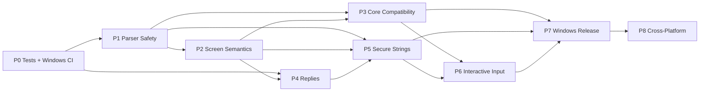

# Harbor Roadmap

Harbor is developed Windows-first. The immediate goal is a correct, stable, measurable Windows terminal. Unix PTY and macOS/Linux runtime work begin only after the Windows feature and stability gates pass.

Protocol coverage is tracked only in [`protocol/checklist.md`](protocol/checklist.md). Completion evidence follows [`validation.md`](validation.md).

## Current Position

Harbor already has a substantial parser, terminal model, renderer, Windows ConPTY path, input encoder, scrollback and selection model, paste confirmation flow, DirectWrite text backend, and widget runtime.

The largest remaining product gaps are:

- incomplete parser safety evidence and wide-cell invariants;
- no terminal reply channel for DSR, DA, DECRQM, DECRQSS, or XTGETTCAP;
- missing useful OSC side effects and their permission boundaries;
- missing focus and mouse protocols;
- incomplete IME preedit and candidate-window integration;
- rendering gaps such as combining marks and box-drawing alignment;
- incomplete latency, benchmark, and Windows dogfood evidence;
- no user configuration, themes, search, or release packaging.

Repository hygiene is also incomplete: a Windows CI workflow is still required, and all standard quality gates must be made continuously repeatable.

## Execution Order

| Phase | Outcome                                               | Status      | Depends on             |
| ----- | ----------------------------------------------------- | ----------- | ---------------------- |
| P0    | Repeatable tests and Windows CI                       | In progress | —                      |
| P1    | Bounded parser contract with fuzz/property evidence   | In progress | P0                     |
| P2    | Correct terminal state and screen invariants          | In progress | P1                     |
| P3    | Core shell, Vim, less, and tmux sequence slice        | In progress | P1, P2                 |
| P4    | Terminal replies and capability queries               | In progress | P0, P1, P2             |
| P5    | Useful and secure OSC/DCS behavior                    | In progress | P1, P2, P4             |
| P6    | Focus, mouse, and complete IME interaction            | In progress | P2, P3, P5             |
| P7    | Windows performance, stability, and daily-use release | In progress | P3, P5, P6             |
| P8    | Deferred Unix PTY and cross-platform release          | Deferred    | Stable Windows release |

```mermaid
graph LR
    P0["P0 Tests + Windows CI"] --> P1["P1 Parser Safety"]
    P1 --> P2["P2 Screen Semantics"]
    P1 --> P3["P3 Core Compatibility"]
    P2 --> P3
    P0 --> P4["P4 Replies"]
    P2 --> P4
    P1 --> P5["P5 Secure Strings"]
    P2 --> P5
    P4 --> P5
    P3 --> P6["P6 Interactive Input"]
    P5 --> P6
    P3 --> P7["P7 Windows Release"]
    P5 --> P7
    P6 --> P7
    P7 --> P8["P8 Cross-Platform"]
```

## P0 — Testability and Windows CI

**Goal:** make every later phase repeatable without relying on a desktop session for model-level behavior.

### Deliverables

- Complete reusable screen snapshots for cursor, cells, modes, margins, scrollback, and alternate-screen state.
- Organize focused protocol tests around checklist sections rather than broad integration scenarios alone.
- Add a Windows CI workflow for format, clippy, workspace tests, and documentation checks.
- Establish a platform-neutral terminal reply boundary over the existing `PtyWriter` path.

### Exit gate

Windows CI enforces the standard gates in [`validation.md`](validation.md), parser fragmentation tests remain green, and failures identify the affected protocol section.

## P1 — Streaming Parser Safety

**Goal:** prove that the existing incremental parser remains bounded, cancellable, and recoverable for arbitrary input.

### Delivered foundation

- ECMA-48/DEC states for CSI, OSC, DCS, APC, PM, and SOS.
- Incremental UTF-8 and sequence parsing.
- Configurable 8-bit C1 recognition.
- Fixed parameter, intermediate, and string limits.
- Discard states that continue scanning for cancellation or termination.

### Configured arbitrary-input evidence (runtime pending)

- Stable property tests cover panic freedom, progress, and parser-retained bounds for arbitrary bytes under both C1 modes.
- `harbor-terminal` property tests compare one-shot and independently chunked `TerminalParser::put_bytes` ingestion, including `PutResult` consumed-prefix and alternate-screen behavior.
- The standalone cargo-fuzz harness and representative CSI, UTF-8, cancellation, nested-escape, and over-limit string-family corpus are checked in and configured.
- Linux CI runtime replay and bounded campaign evidence are pending; Windows configuration is not represented as a fuzz pass.
- The parser-only memory contract is explicit: fixed CSI/UTF-8/OSC/string retention is bounded, while the fuzz sink retains no callbacks.

### Remaining work

- Record Linux CI cargo-fuzz runtime replay/campaign evidence before marking arbitrary-input checklist claims complete.
- Issue #96: complete the full string-family by terminator/canceller matrix and its focused deterministic regressions.
- Keep unsupported but syntactically valid sequences consume-only and non-visible.

### Exit gate

No arbitrary-byte input panics, stalls indefinitely, or grows parser memory beyond configured bounds.

## P2 — Terminal State and Screen Semantics

**Goal:** make state mutations correct before adding more dispatch cases.

### Delivered foundation

- Soft-wrap metadata is stored per row and carried through print, newline, scroll, resize, and reset; resize is documented non-reflow (ADR-0018), RIS clears markers while DECSTR preserves them.

### Remaining work

- Wide cells are normalized across erase, insert, delete, line, scroll, and rectangle operations; retain regression coverage for margins, protection, overlap, and damage tracking.
- Delivered issue #88 pending-wrap coverage across cursor movement, controls, erase, resize, reset, soft-wrap metadata, and parser chunk equivalence; verified with `cargo test --workspace`.
- Verify insert mode, horizontal margins, tabs, protection, alternate-screen isolation, RIS, and DECSTR as complete state transitions.

### Exit gate

Editing operations preserve the wide-cell invariant, and reset/mode transitions restore documented state deterministically.

## P3 — Core Compatibility Slice

**Goal:** complete the sequence set needed by shells, Vim/Neovim, less, fzf, and tmux before optional extensions.

### Remaining work

- Complete required ESC and cursor commands, including the missing single-shift and movement forms.
- Complete the required alternate-screen, focus, synchronized-output, and compatibility modes or document exclusions.
- Add focused parser-through-model samples for the minimum compatibility set.
- Run Windows smoke sessions for shell redraw, alternate screen, resize, and application key modes.

### Exit gate

The minimum compatibility set in the protocol checklist is either passing or explicitly excluded with evidence.

## P4 — Replies and Device Queries

**Goal:** allow applications to query Harbor without coupling parser code to ConPTY.

### Delivery order

1. `ReplySink`/`TerminalReply` boundary using the existing PTY writer.
2. DSR status and CPR, including private CPR.
3. Primary and Secondary DA from an explicit capability registry.
4. DECRQM/DECRPM for known and unknown modes.
5. DECRQSS for SGR, margins, cursor style, and protection.
6. XTGETTCAP for capabilities Harbor actually supports.

### Constraints

- Replies have explicit maximum lengths.
- Capability responses never advertise unchecked behavior.
- Where practical, replies round-trip through a second parser in tests.

### Exit gate

The shell/Vim/tmux query slice completes without hangs or false capability claims.

## P5 — Secure String Features

**Goal:** turn safe framing into useful host effects without creating injection, privacy, or memory risks.

### Delivery order

1. Complete limit and cancellation evidence for all string families.
2. OSC 0/1/2 title events with filtering and length bounds.
3. OSC 7 working-directory metadata without file-system side effects.
4. OSC 8 hyperlink state with URI limits and reset behavior.
5. OSC 10/11/12 colors and resets where needed.
6. OSC 133 shell markers as metadata.
7. OSC 52 only behind explicit permission and strict encoded/decoded limits.

Sixel, Kitty graphics, file transfer, notifications, and remote clipboard reads remain deferred until independent permission and memory designs exist.

### Exit gate

Every implemented string effect has explicit size, cancellation, permission, and reset behavior.

## P6 — Interactive Input

**Goal:** complete application-controlled input behavior on Windows.

### Delivered foundation

- Application cursor and keypad modes.
- Home, End, Page, function, editing, and modifier encodings.
- Bracketed paste and confirmation flow.
- IME commit routing without sending preedit text to the PTY.

### Remaining work

- Focus reporting (`CSI I` / `CSI O`) behind mode `?1004`.
- X10, normal, button-event, any-event, and SGR mouse modes with correct priority.
- IME preedit rendering and candidate-window positioning near the terminal cursor.
- Configurable keybindings and conflict policy.
- ModifyOtherKeys or Kitty keyboard support only after traditional input is stable.

### Exit gate

Vim and tmux receive deterministic keyboard, paste, focus, mouse, and committed IME bytes without protocol-marker injection.

## P7 — Windows Stability and Daily Use

**Goal:** produce a measured Windows daily-use release.

### Rendering

- Underline styles and color, overline, conceal/reveal.
- Combining-mark composition without grid corruption.
- Continuous DEC Special Graphics and box-drawing joins.
- DPI/font-size atlas invalidation and visual regression coverage.

### Performance

- Complete R1 and R2 from [`performance/optimization-plan.md`](performance/optimization-plan.md).
- Record throughput, frame, upload, atlas, present, and input-latency metrics.
- Benchmark heavy output, large files, colored logs, Vim redraw, and scrollback.
- Introduce background parser/model work only if profiling proves UI-thread draining is a sustained bottleneck.

### Product and stability

- Handle shell crash, device loss, out-of-memory, and panic logging.
- Add TOML configuration, themes, search, and Windows packaging.
- Main-window Windows Acrylic through Default Background Cells uses a unified compositor tint: DesktopAcrylicController when the Windows App SDK is available, otherwise accent-policy Acrylic, with an opaque dark fallback. Windows 10 Caption Degradation — an opaque caption strip on some themes — is accepted; system min/max/close buttons stay DWM-drawn. Paste confirmation is excluded and stays an opaque separate window.
- Run documented Windows dogfood sessions and record known exclusions.

### Exit gate

The Windows acceptance, fuzz, benchmark, diagnostics, and dogfood requirements in [`validation.md`](validation.md) are recorded and passing.

## P8 — Deferred Cross-Platform Support

**Goal:** bring the stabilized feature set to Unix hosts without forking parser, model, reply, or input behavior by platform.

### Deliverables

- Implement Unix PTY behind `PtyEndpoints`, `PtyWriter`, and `PtyControl`.
- Support shell startup, controlling-terminal setup, resize, read, write, child exit, and safe shutdown.
- Add macOS and Linux CI jobs and PTY integration tests.
- Run the same protocol/model suite and a documented application matrix on supported Unix hosts.

### Entry gate

P8 starts only after the Windows P7 release gate passes. Unix work does not block P0–P7.

## Release Mapping

| Release           | Required phases | Meaning                                                            |
| ----------------- | --------------- | ------------------------------------------------------------------ |
| Windows preview   | P0–P6           | Core compatibility and interaction are usable for targeted testing |
| Windows daily-use | P7              | Measured, packaged, and dogfooded Windows release                  |
| Cross-platform    | P8              | Unix PTY and supported macOS/Linux runtime evidence                |

## Working Agreement

- Stabilize parser and state contracts before adding optional protocols.
- Separate parsing, terminal state, replies, and host side effects.
- Prefer complete compatibility slices over scattered extensions.
- Centralize limits and permission policy.
- Update protocol coverage only from evidence.
- Keep historical measurements and completed plans out of this roadmap.
