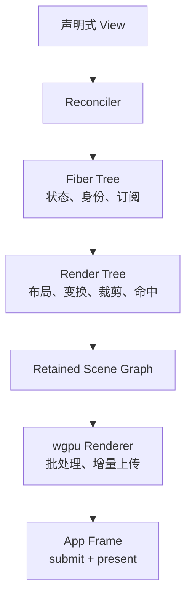

# Harbor Widget Runtime 设计

> 状态：提案
> 范围：Harbor 内部使用的、基于 Rust 与 wgpu 的声明式 GPU UI Runtime。
> 本文独立描述目标架构与实施顺序；不定义稳定的第三方公共 API。

## 1. 目标

Harbor Widget Runtime 用声明式界面描述驱动完整的 UI 链路：组件状态变化触发局部重构，布局结果生成保留式 GPU 场景，宿主将场景编码到现有 wgpu 帧中。

系统应满足：

- 以 Rust 表达 Widget 树、局部 State 和事件行为；
- 不依赖操作系统原生控件，布局、命中测试和绘制完全由 Runtime 控制；
- 使用 retained scene 与增量 GPU 更新，静止界面不持续请求重绘；
- 与现有 terminal renderer 同帧合成，且不复制 Device、Queue 或 Surface；
- 保留终端作为可布局、可聚焦的 `CustomPaint` 绘制区域，允许渐进迁移。

## 2. 非目标

第一版不实现完整桌面 GUI 框架，也不包含：

- React 式并发渲染或时间切片；
- 任意路径、滤镜、非矩形裁剪与复杂图像效果；
- 完整富文本、复杂脚本 shaping、无障碍桥接；
- 通用滚动容器、虚拟列表、手势识别；粘贴确认预览所需的专用只读垂直滚动除外；
- 用于第三方发布的稳定 DSL 或宏语法。

这些能力应在真实 UI 使用场景和 profiling 数据证明需要时再增加。

## 3. 术语与分层

| 名称              | 生命周期 | 职责                                                                |
| ----------------- | -------: | ------------------------------------------------------------------- |
| `View` / `Widget` |       短 | 应用声明的不可变界面描述，可在每次 build 后丢弃。                   |
| `Fiber`           |       长 | 保留组件身份、hook/state、Signal 订阅、子 Fiber 与脏标记。          |
| `RenderNode`      |       长 | 保存布局结果、变换、裁剪、绘制顺序和可命中区域。                    |
| `SceneItem`       |       长 | GPU 可见的绘制项，如矩形、文字、图像和外部绘制。                    |
| `Primitive`       | 短或缓存 | RenderNode 输出的标准化绘制输入。                                   |
| `GpuResource`     |       长 | pipeline、bind group、字体图集、网格、instance buffer 等 GPU 缓存。 |



Widget 是描述，不是长期持有的可变控件。Fiber 管理生命周期，RenderNode 管理几何和绘制，Renderer 管理 GPU 状态。禁止让单一 `Widget` trait 同时承担 build、layout、paint、event 和状态管理；该设计会把声明式更新与 Rust 的可变借用纠缠为命令式控件树。

## 4. Crate 与宿主接缝

新增 `harbor-widget` crate：

```text
crates/harbor-widget/
├── lib.rs          # Runtime、View、Component、公开几何与事件类型
├── runtime.rs      # 调度、事务、dirty queue、生命周期
├── fiber.rs        # Fiber arena、keyed reconciliation、hooks
├── signal.rs       # Signal 与依赖收集
├── view.rs         # View、属性、Key
├── layout/         # constraints、flex、RenderNode、geometry
├── input/          # UiEvent、hit test、focus、pointer routing
├── scene/          # Primitive、SceneItem、scene delta、paint order
├── renderer/       # wgpu quad/text/image/path renderer
├── animation.rs    # frame clock 与动画订阅
└── host.rs         # Frame 与宿主抽象；不依赖 winit
```

Runtime 不创建窗口、不持有主 Surface、不提交 command buffer，也不调用 present。App 继续拥有这些资源，Widget Runtime 只对宿主提供编码能力：

```rust
pub struct Runtime { /* private */ }

impl Runtime {
    pub fn set_root(&mut self, root: impl Component + 'static);
    pub fn dispatch(&mut self, event: UiEvent, now: Instant) -> FrameRequest;
    pub fn update(&mut self, now: Instant) -> FrameRequest;
    pub fn encode(&mut self, frame: &mut UiFrame<'_>);
}
```

`UiFrame` 由宿主创建，提供 `Device`、`Queue`、`CommandEncoder`、目标 `TextureView`、logical/physical viewport 和 scale factor。`harbor-widget` 可依赖 wgpu，但不得依赖 winit 或现有 terminal model。

## 5. Fiber 与重构

### 5.1 节点身份

节点 ID 必须可检测陈旧引用：

```rust
pub struct FiberId {
    index: u32,
    generation: u32,
}
```

使用 generation arena。slot 可复用，旧 ID 因 generation 不一致而失效。事件、Signal 订阅、动画回调和 pointer capture 均不得作用于已卸载后复用的新节点。

### 5.2 reconciliation 规则

1. 同一位置且 View 类型、`Key` 均相同：复用 Fiber、State、焦点和可复用 GPU 资源。
2. 类型或 `Key` 改变：卸载旧子树，清理订阅、动画和 pointer capture，再创建新 Fiber。
3. 无 `Key` 的同级节点以位置匹配。
4. 可重排列表必须使用稳定 `Key`。
5. 无 key 列表重排导致状态丢失是预期行为，须由测试锁定。

组件通过普通 Rust Builder 表达，首版不引入宏：

```rust
fn tab_bar(cx: &mut BuildCx, tabs: &[Tab]) -> View {
    let active = cx.use_state(|| 0usize);

    Row::new()
        .children(tabs.iter().enumerate().map(|(index, tab)| {
            TabButton::new(tab.title.clone())
                .key(tab.id)
                .selected(*active.read() == index)
                .on_click({
                    let active = active.clone();
                    move |_| active.set(index)
                })
        }))
        .into()
}
```

## 6. State、Signal 与调度

`Signal<T>` 是 UI 线程中的细粒度状态源。构建 Fiber 时 Runtime 记录其读取的 Signal；写入 Signal 后只失效订阅它的 Fiber。

```text
事件处理或 UI 消息
  → 写入一个或多个 Signal
  → 标记订阅 Fiber 为 BUILD_DIRTY
  → 合并本事件循环内的更新
  → request_redraw
  → 下一帧提交
```

跨线程任务不能直接写 Signal；它们发送 `UiMessage`，由 UI 线程消费后更新状态。

脏标记至少区分：

| 标记             | 含义                             | 后续工作           |
| ---------------- | -------------------------------- | ------------------ |
| `BUILD_DIRTY`    | View、属性或 State 改变          | reconciliation     |
| `LAYOUT_DIRTY`   | 约束、尺寸或位置改变             | 当前子树重新布局   |
| `PAINT_DIRTY`    | 视觉属性改变                     | 更新对应 SceneItem |
| `HIT_TEST_DIRTY` | geometry、transform 或 clip 改变 | 更新命中数据       |

例如颜色变化只标记 paint；标题变长则标记 layout、paint 和 hit test；窗口 resize 标记根布局并向下传播。

首版 Fiber 表示保留生命周期节点和局部失效边界，不实现可中断 work loop。后续仅在大型树造成输入延迟时增加 `Input > Animation > Normal` 优先级与帧预算调度。

## 7. Layout

布局使用 logical pixel / dp。物理像素仅在 Renderer 边界乘以 scale factor，确保 DPI、命中坐标和布局坐标一致。

```rust
pub struct BoxConstraints {
    pub min: Size,
    pub max: Size,
}
```

每个 RenderNode：

1. 接收父约束；
2. 计算自身 Size；
3. 为子节点生成约束；
4. 写入子节点 Rect；
5. 维护 local transform、clip、paint order 和 hit region。

首版 Widget 集合：

- `SizedBox`
- `Padding`
- `Row`
- `Column`
- `Stack`
- `Align`
- `Text`
- `Button` / `TabButton`
- `CustomPaint`

Flex 的 fixed children、剩余空间分配、cross-axis alignment、约束收缩和溢出规则必须有纯 CPU 测试。

## 8. 输入、命中测试与焦点

事件路由采用路径模型，而非仅向单个命中节点直接调用：

```text
pointer event
  → hit test
  → root 到 target 的 capture phase
  → target phase
  → target 到 root 的 bubble phase
```

Event handler 只能向 `EventCtx` 写入命令：

```rust
ctx.request_focus(fiber_id);
ctx.capture_pointer(pointer_id);
ctx.release_pointer(pointer_id);
ctx.invalidate_paint();
ctx.stop_propagation();
```

Runtime 在事件结束后应用命令，避免 handler 与 Fiber arena、Focus manager 的可变借用冲突。

首版必须支持：

- hover target；
- pointer capture：按下后目标可持续接收 move/up/cancel；
- pointer cancel 或 up 时释放 capture；
- `FocusScope` 中的 Tab / Shift+Tab 焦点遍历；
- Enter / Space 激活可聚焦控件；
- 键盘与 IME 仅派发给当前焦点。

默认命中测试按逆绘制顺序遍历 Render Tree，并逐层检查 transform 与 clip。首版不使用全局 R-tree；一般 UI 树层级浅且局部性好，R-tree 会引入 transform、clip、遮挡顺序与重建成本。大型画布或虚拟列表被 profiling 证明为瓶颈时，才为特定节点加入空间索引。

## 9. Retained Scene 与 GPU Renderer

RenderNode 的变化写入 `SceneDelta`，Renderer 根据 delta 更新持久化 GPU 缓冲，而不是每帧重建全部顶点数组。

首版 Primitive：

```rust
pub enum Primitive {
    Quad {
        rect: Rect,
        color: Color,
        corner_radius: f32,
    },
    Text {
        run: TextRunId,
        origin: Point,
        color: Color,
    },
    Border {
        rect: Rect,
        width: f32,
        color: Color,
        corner_radius: f32,
    },
    External {
        draw: ExternalDrawId,
    },
}
```

Renderer 规则：

- Rect / rounded rect 使用 instanced quad pipeline；
- Text 使用 glyph atlas 与 instanced glyph quad pipeline；
- Image 与 path 是后续能力；path tessellation 结果必须缓存为 mesh；
- 矩形 clip 映射为 GPU scissor；非矩形 clip 后续通过 stencil 或 mask 实现；
- 只批处理相邻、pipeline/bind group/scissor 相同且不改变 paint order 的 SceneItem。

透明 UI 依赖绘制顺序。禁止为了降低 draw call 而跨越半透明元素重排 SceneItem。

### CustomPaint

`PaintCtx` 不暴露 `&mut wgpu::RenderPass`。RenderPass 生命周期、batch flush、clip 和状态恢复必须由 Renderer 控制。

外部绘制使用：

```rust
pub trait ExternalDraw {
    fn encode(&mut self, ctx: &mut ExternalDrawCtx<'_>);
}
```

Renderer 处理 `Primitive::External` 时 flush 当前 batch，设置当前节点的 transform/clip，执行外部 draw，再恢复 renderer 状态。`CustomPaint` 将外部 draw 作为 Widget 树中的可布局、可裁剪、可聚焦节点；终端视口通过它继续由主 crate 管理 PTY 与 terminal model。

## 10. 文字策略

Widget 文本与终端文本都需要字体发现、fallback、rasterization、atlas packing、GPU texture upload 和 metrics。不得复制现有文字/atlas 实现。

当 Widget 系统需要真实文字渲染时，抽取共享文本核心：

```text
harbor-text
├── FontBook
├── FontFallback
├── GlyphRasterizer
├── GlyphAtlasData
├── TextMetrics
└── TextRun cache
```

`harbor-render` 与 `harbor-widget` 各自拥有 GPU renderer adapter，共享 CPU 文本模型和 raster 数据。terminal 的等宽逐格文本与通用 UI shaping 不完全相同；复杂脚本、双向文本、ligature、selection/caret 不进入首版。

## 11. 与 Harbor 的帧合成

App 保持 GPU 资源和 Surface 生命周期的唯一所有权：

```text
App::RedrawRequested
  1. 获取当前 surface texture
  2. 创建一个 CommandEncoder
  3. widget Runtime 编码根 Widget 树
  4. `CustomPaint` 调用 terminal renderer，Runtime 按绘制顺序编码其余 UI / overlay
  5. queue.submit(encoder.finish())
  6. present(surface texture)
```

Widget Runtime 不得创建第二套 Device、Queue 或主 Surface，也不得独立 submit/present。该约束确保单帧、单次提交、正确的 alpha compositing，并为终端迁移为 `CustomPaint` 提供稳定路径。

## 12. 第一版交付：终端嵌入与粘贴确认 UI

第一版验收标准：

- 根 Widget 树通过 `CustomPaint` 承载终端视口；其 rect、裁剪、绘制顺序和焦点由 Widget Runtime 管理，同时保持现有 terminal renderer、PTY 和 terminal model 的行为；
- 终端与 Widget Runtime 使用同一个 `Device`、`Queue`、`Surface` 和 `CommandEncoder`，同帧编码并且单次 submit；
- 现有独立 `winit` 粘贴确认窗口被移除；触发确认时，主窗口的 Widget 树在终端之上绘制居中的模态确认 UI；
- 模态 UI 保持现有确认门语义：仅在 bracketed paste 关闭且粘贴内容包含有效换行时出现；确认时以当时的 `InputModes` 发送原始内容，取消时不向 PTY 发送内容；
- 模态 UI 显示转义控制字符、自动换行且可只读垂直滚动的粘贴预览；支持点击按钮、`y` 确认、`n` / `Esc` 取消、Tab / Shift+Tab 焦点切换及 Enter 激活，默认焦点为取消；
- 模态 UI 打开时阻止键盘输入和新的粘贴请求到达终端；PTY 输出、终端绘制、滚动浏览和复制继续工作；
- resize 后终端和模态 UI 正确重新布局；静止时 Runtime 不再请求 redraw。

第一版不实现图片、path、通用滚动容器、复杂动画、完整富文本、通用 DSL 宏、R-tree 或时间切片。

## 13. 实施顺序与验证

### Phase 0：保留树与纯 CPU 核心

实现 generation arena、`Key`、View、reconciliation、Signal、dirty flags、geometry 和 constraints。

验证：相同 type/key 保留 state；key 变化卸载订阅；陈旧 ID 无法命中新节点；Signal 仅失效订阅 Fiber；layout 始终满足 constraints。

### Phase 1：布局、Scene Graph 与 Quad Renderer

实现基础容器、retained scene、scene delta、instanced quad renderer 与 App 同帧编码接缝。

验证：scene delta 单元测试；Harbor 显示静态根场景；resize 不破坏 surface 生命周期；静止时不持续 redraw。

### Phase 2：输入、焦点与模态交互

实现 `UiEvent`、hit test、capture/bubble、pointer capture、`FocusScope`、`Button`、模态事件拦截与粘贴确认状态。

验证：点击、键盘焦点、激活、拖出后释放、模态打开时终端输入隔离，以及确认/取消均正确。

### Phase 3：共享文字、CustomPaint 与粘贴确认 UI

抽取共享文本核心，实现 Widget label text batch 和 `CustomPaint`，将终端视口接入根 Widget 树，并以主窗口 overlay 替换独立粘贴确认窗口；实现粘贴预览的控制字符转义、自动换行与专用只读垂直滚动。

验证：文字资源不重复创建；terminal/widget 同帧正确分层；粘贴确认保留既有门控和键盘语义；DPI 改变后文字、布局和命中区域一致。

### Phase 4：按性能数据扩展

在 profiling 支持后增加 image batch、path mesh cache、虚拟列表、非矩形 clip、动画 timeline、调度优先级、局部空间索引、无障碍和可中断 work loop。

## 14. 关键不变量与风险

| 不变量 / 风险 | 约束                                                       |
| ------------- | ---------------------------------------------------------- |
| GPU 所有权    | App 是 Surface、submit、present 的唯一所有者。             |
| 状态身份      | `Key` 和 generation ID 决定状态复用与陈旧引用安全。        |
| 事件安全      | pointer capture、焦点和延迟回调不得指向已卸载节点。        |
| 绘制正确性    | alpha compositing 下保持 paint order；仅合并相邻兼容批次。 |
| 静止性能      | 无 dirty 节点、动画或外部 draw 请求时不 request_redraw。   |
| 文本一致性    | 两个 renderer 共用文字核心，不维护重复 atlas/raster 逻辑。 |
| 扩展节奏      | Fiber 并发化、R-tree、复杂动画均以后续 profiling 为前提。  |
